
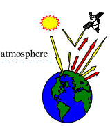</img>

<u>*Objective (theory):*</u>

- Stephan-Boltzmann law: $M=\sigma.T^4$, with $\sigma=5.6704\times10^{-8}\: W/m^2/K^4$ (cf. [Chapter VI](../../Physical_bases/physical_bases.md))
- Planck law: $L_{B,\lambda}(T)=\frac {2.h.c^2} {\lambda^5.(e^{\frac {h.c} {\lambda .k.T}} - 1)}$ $W/m^2/sr/m$ ($h=6.63\times 10^{-34}\:J.s$, $k=1.3807\times 10^{-23}\: J/K$)
- Brightness temperature $T_B$: ground, Bottom (BOA) / Top (TOA) of the Atmosphere,...
- Scene emissivity: $\epsilon(\Omega)=1 - \rho(2\pi \rightarrow \Omega)$: isotropic ($\epsilon(\Omega) = \epsilon$) for lambertian scene $(\rho(\Omega)=\rho)$
- Scene not a blackbody if:
    - scene {$\epsilon_{scene} \neq 1,T_{scene}$}: $\nexists T | L_{B}(\lambda, T)=\epsilon_{scene}.L_B(\lambda,T_{scene}) \:\: \forall \lambda \implies T_{B,scene}(\lambda_1) \neq T_{B,scene}(\lambda_2) \: if \: \lambda_1 \neq \lambda_2$
    - scene made of 2 blackbodies: $\nexists T | L_{B}(\lambda, T)=L_{B}(\lambda, T_1) + L_{B}(\lambda, T_2) \:\: \forall \lambda \implies T_{B}(\lambda_1) \neq T_{B}(\lambda_2) \: if \: \lambda_1 \neq \lambda_2$

<u>*Objective (DART):*</u> to manage DART sequences and LUT, and to learn DART modes T (atmosphere / earth thermal emission) and R+T (sun illumination + atmosphere / earth thermal emission).

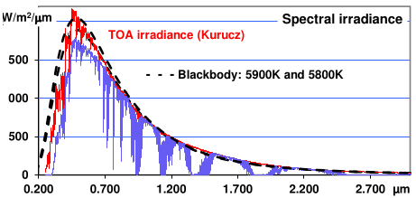
*Sun and blackbody (5800K and 5900K) emission.*
</img>

The wavelength $\lambda_{max}$ at which maximal emission occurs decreases with temperature T (Wien law).

$\lambda_{max} \approx 0.5\mu m$ if T=5800K and $\lambda_{max} \approx 9.7\mu m$ if T=300K

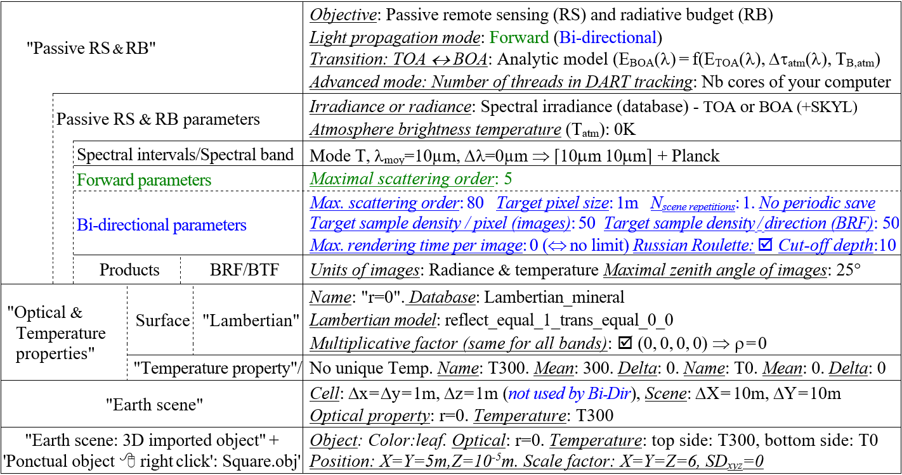
*WP2A parameters with those specific to the Forward (DART-FT) and Bi-directional (DART-Lux) modes.*
</img>

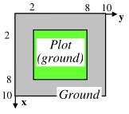
*DART simulated scene with "ground plot.*
</img>

The scene is a ground plot surrounded by ground. In DART scenes, the Ox axis is along vertical downward. Enter the corners in the anti clockwise direction. $Area_{plot} = 36m^2, Area_{ground} = 64m^2$.

### 1) Brightness temperature of a homogeneous landscape: WP2A

<u>*Objective:*</u> to study the impact of scene elements reflectance on scene brightness temperature..

#### 1.a - WP2A-FT (CT=1") and WP2A-Lux (CT=9")

!!!note
    Create the mono-band simulation WP2A-FT, then save it as WP2A-Lux.

***Display images*** $T_{B}(x,y)$: tool `View / Image` for nadir and oblique ($\theta_V=22°,\phi_V=30°$)

***Display*** 1D plot $T_B(\theta_v,\phi_v =cst)$: with  `View / Directional R... / 1D` + file `WP2A.../Output/BAND0/Tapp/ITERX/` $T_{app}$ 

!!!question
    Why TB,scene is isotropic and equal to 300K?

***Repeat the above steps for the 2 following cases:***

- $\rho_{ground} = \rho_{plot} = 1$. Why $T_{B,scene} = 0K$?
- $\rho_{ground} = \rho_{plot} = 0.5$. Thus: $\epsilon=0.5$ and $L_{scene}=\frac {L_B} {2}$. Why does $T_{B,scene}(262K)$ differ from $\frac {T_{B,scene}} {2} = 150K$ ?

!!!note
    WP2A_Lux gives most WP2A_FT products, plus the 360° x 90° BTF map $T_{B,scene}(\theta,\phi)$, used to create the $T_{app}$ file.
!!!question
    DART-Lux, below: add the nadir viewing direction, unset all items of "Products" ($\implies$ no creation of BTF map), and create a LUT with products for the option "Only for the added directions". It will decrease CT. 

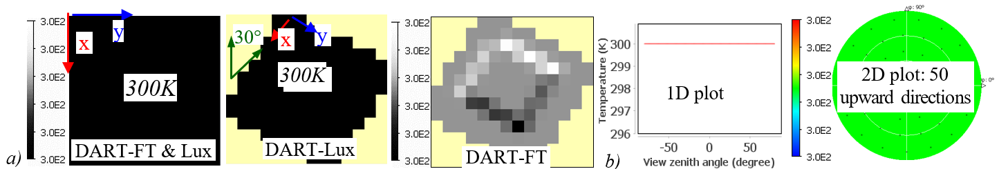
*$T_B$. a) DART-FT and DART-Lux nadir and oblique ($\theta=22°, \phi=30°$) images. b) 1D and 2D plots.*
</img>

### 2) Impact of sun reflected radiation on ground brightness temperature: WP2Ba and WP2Bb (CT=1")

<u>*Objective:*</u> to study how sun reflected radiation affects the scene brightness temperature $T_{B,scene}$, at different $\lambda$.

***Copy WP2A as WP2Ba:*** set 3 bands {$3\mu m$: mode T+R, $3\mu m$: mode T, $10\mu m$: mode T; $\Delta \lambda=0$} and $\rho_{ground} = \rho_{plot} = 0$.
!!!Question
    Why TB,scene = 300K for 3µm (mode T+R), 3µm (mode T) and 10µm (mode T)?

***Copy WP2Ba as WP2Bb:*** $\rho_{ground} = \rho_{plot}^{top\ face} = 0.5$.

!!!question
    Why $T_{B,scene}(3\mu m, mode\: T) =288K<300K$, and $T_{B,scene}(3\mu m, mode \:R+T)=376K \gg 300K$?
!!!question
    Why $T_{B,scene}(3\mu m, mode\: T) > T_{B,scene}(10\mu m, mode \:T) = 262K$ whereas $\epsilon_{3\mu m} = \epsilon_{10µm}$ ?
!!!question
    Why $T_{B,scene}(\theta,\phi=cst)=cst \forall \theta, \phi$? $T_{B,scene}$ is displayed with the tool `View / Directional… / 1D` (see below)?

Here, the tool displays the DART file $T_{app}$.

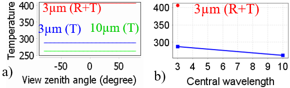
*Scene brightness temperature $T_{B,scene}$. $\rho_{plot} = \rho_{ground} =0.5, T_{plot} =300K, T_{ground} =300K$. a) WP2Bb-FT: $T_B(\theta,\phi=cst)$. Display tool: `View /Direct…/ 1D` + file $T_{app}$. b) WP2Bb-Lux: $T_{B,scene}(\theta=0°)$ in the LUT.*
</img>

!!! note
     to add curves (i.e., additional files Tapp)

### 3) Brightness temperature of 2 adjacent blackbodies at different temperatures: WP2C (CT=1")

<u>*Objective:*</u> to show that the juxtaposition of 2 blackbodies at different temperatures is not a blackbody.

***Copy WP2A as WP2C*** ({$3\mu m, 6\mu m, 10\mu m, \Delta \lambda=0$, mode T}; $T_{ground} =300K$, $T_{plot} =500K$, $\rho_{ground}= \rho_{plot} = 0$) and **run it**

Scneradiance is $L_{scene}(\lambda)=0.36 L_B(\lambda,T_{B,plot}) + 0.64 L_{B,ground}$.

!!!question
    The scene is not a blackbody (Figure below). Indeed, its brightness temperature $T_{B,scene}$, defined by $L_B(\lambda,T_{B,scene}) = L_{scene}(\lambda)$, varies with $\lambda$. File `dart.txt` gives: $T_{B,scene,3\mu m}=452K > T_{B,scene,6\mu m}=418K > T_{B,scene,10\mu m}=395K$. 
!!!question
    $T_{B,scene}$ differs from the spatial average of $T_{B,x,y}$. Verify it with the nadir image $T_{B,scene}(\lambda)$  (2nd figure below). The tool `Stats` of `View Image` menu gives $T_{B,x,y}= \frac{Area_{plot}.T_{B,plot}(\lambda)+Area_{ground}.T_{B,ground}(\lambda)}{Area_{plot}+Area_{ground}} =372K$, for the 3 bands.

<u>*Proof:*</u> Scene = 2 blackbodies ($T_1,T_2$) of same area $\implies L_{scene}=L_B(T_{B,scene})=\frac {L_B(T_1)+L_B(T_2)}{2} > L_B(\frac{T_1+T_2}{2})\implies T_{B,scene} > \frac{T_1+T_2}{2}$

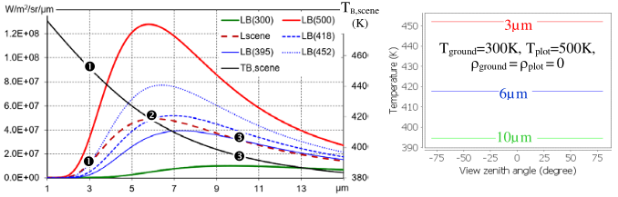
*Brightness temperature $T_{B,scene(\lambda)}$ (`Scene_Brightness_Temperature.xlsx`).*
</img>

1. $L_B(\lambda, T=300K, 395K, 418K, 452K)$, $L_{B,scene}(\lambda)$ and $T_{B,scene}(\lambda)$: 452K at $3\mu m$ (: $L_{B,scene}(3\mu m)=L_B(452K)$, 418K at $6\mu m$ (: $L_{B,scene}(6\mu m)=L_B(418K))$ and 395K at $10\mu m$ (: $L_{B,scene}(10\mu m)=L_B(395K)$).

2. $T_{B,ground}(\theta_v)$, $T_{B,plot}(\theta_v)$. Plot them at a few $\phi_v$ to check their isotropy (i.e., $T_{B,scene}(\theta_v,\phi_v=cst) \forall (\theta_v,\phi_v))$.

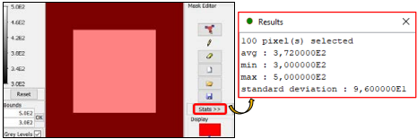
*Computation of $\overline{T}$ with tool 'Stats'.*
</img>

### 4) Simulation of spectral and broadband quantities: WP2D

<u>*Objective:*</u> scene thermal infrared (TIR) spectra and broadband ($E,T_B$,…) over [$3\mu m \:15\mu m$] in mode (R+T).

<u>*Scene:*</u> 2 blackbodies {$\rho_{ground} = \rho_{plot} = 0, T_{ground} = 300K, T_{plot} = 400K$}.$T_{atm}=280K$ (Figure below). Results are in the LUT.

<u>*2 methods*</u>: multi-band simulation (12 bands) }and sequence of 12 mono-band simulations, followed by BroadBand.

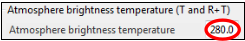
*Atmosphere defined as an isotropic plane surface with $T_B=280K$ where it is a black body (e.g.,$6.5\mu m$).*
</img>

#### 4.a - Multi-band simulation 
(12 bands: $[3\mu m \:4\mu m]$,…,$[14\mu m \:15\mu m]$; mode "R+T"): WP2D_multi (CT=1")

The simulation stores spectral data (index $\lambda$) in the file `dart.txt` (see the table below) and in a LUT (see the table below):

- TOA direct sun irradiance $E_{TOA}(W/m^2/\mu m)$: irradiance of an horizontal plane. $E_{TOA \rightarrow 0}$ if $\lambda \gg 1$ (e.g., $10\mu m$).
- BOA direct sun irradiance $E_{BOA,dir}(W/m^2/\mu m)$: irradiance of an horizontal plane.
- BOA diffuse irradiance $E_{BOA,diff}(W/m^2/\mu m)$: atmosphere thermal emission and scattering of sun radiation.
- BOA total $(W/m^2/\mu m)$: $E_{BOA} = E_{BOA,dir} + E_{BOA,diff}$ (horizontal plane).
- Total back-scattered to BOA: here, it is null because there is no atmosphere R.T.
- Absorption $E_{TOA} - E_{BOA}$ , $skyl = \frac {BOA\:diffuse\:irradiance} {BOA\:total\:irradiance}$, $T_{b,scene}(K)$ and $M_{scene, \Delta \lambda} \:(W/m^2/\mu m)$.

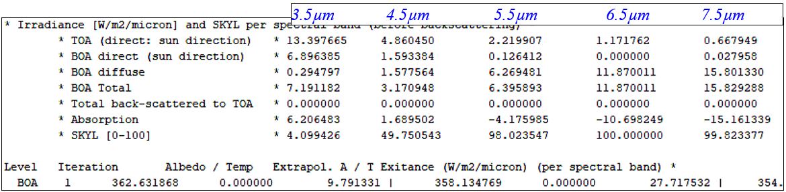
*Part of dart.txt file: multi-band simulation (12 bands).*
</img>

!!!question
    Verify the relationship between the BOA spectral radiance $L_{BOA}(\lambda)$ and exitance $M_{BOA}(\lambda)$ for lambertian surfaces.
!!!question
    The scene direct irradiance $E_{BOA,dir}(\lambda)$ decrease irregularly with $\lambda$? $E_{BOA,dir}(6.5\mu m)=0$, $E_{BOA,dir}(7.5\mu m)=0.028$. Why?
!!!question
    The scene irradiance varie decrease erratically from $3\mu m$ to $15\mu m$. Why?
!!!question
    The exitance $M_{BOA}(\lambda)$ increase, from $3\mu m$ to $\approx 8\mu m$ then decreases. Why?
!!!question
    $T_B(\lambda)$ decrease from 364K to 340K when $\overline{\lambda}$ increases from $3.5\mu m$ up to $14.5\mu m$. Why?
!!!question
    The BroadBand tool indicates $T_{B,\Delta\lambda}$ over $[0.4\mu m ; 15\mu m] = 339K$ whereas $T_B(\lambda) > 340K$ $\forall \lambda$. Why?

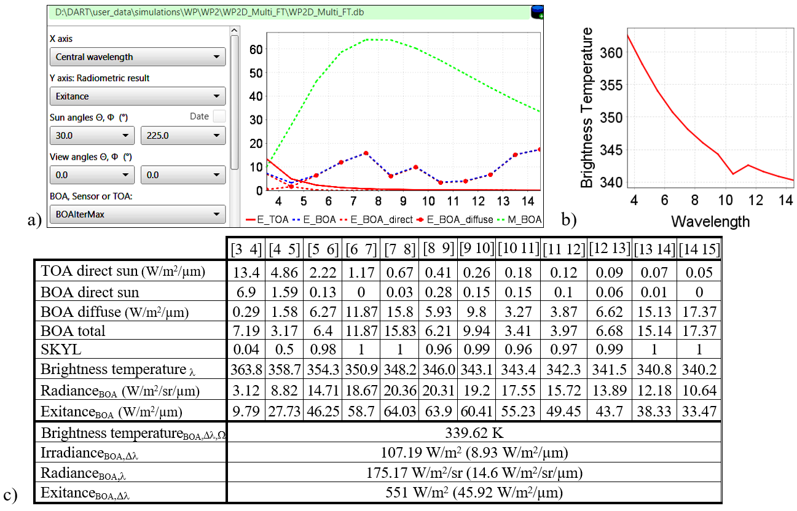
*Scene spectral and broadband quantities over [$3\mu m \:15\mu m$]. a) LUT menu and spectral irradiance & exitance. b) Spectral brightness temperature. c) Values and Broadband data.*
</img>

#### 4.b - Spectral sequence
(12 mono-band simulations: [$3\mu m \:4\mu m$],…,[$14\mu m \:15\mu m$]; mode "R+T"): WP2D_seq (CT=6")

Copy `WP2D_multi as WP2D_seq`, keep 1 band only. Then, create and run a sequence of 12 bands (see below).

!!!question
    Verify for a few values, that spectral and broadband quantities of the table above are correct.
!!!question
    Is it preferable to use the sequence of mono-band simulations or the multi-band simulation?

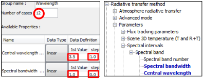
*Sequence of 12 mono-band simulations ($\lambda_{mean}= 3.5\mu m, 4.5\mu m,..., \Delta \lambda=1\mu m$).*
</img>

The BroadBand and SceneSpectra tools use a few output files. Hence, in order to use them, set the option "Using scene spectra & broadband" in the Delete sub-menu of the Sequencer menu..

### 5) Non spectral sequences

#### 5.a - Detection of ice vs ground pixels, at 2 atmosphere temperatures: WP2E (CT=10")

<u>*Objective:*</u> for which $\rho_{ground}$ values, a low flying nadir imaging TIR sensor ($10\mu m$, $\Delta \lambda=0.2\mu m; 10K$ equivalent sensitivity) flying at 0km can set apart pure ice ($\rho_{ice}=0.273K \implies T_{B,ice}=273K$) and pure ground ($\rho_{ground}, 273K$) pixels, if $T_{B,atm}= 280K$ and $240K$.

<u>*Approach:*</u> $\rho_{ground}$ for which $T_{B,scene} > T_{B,scene} + 10K$ on the plot $T_{B,scene} (\rho_{ground}, T_{B,atm}=280k$ and $240K$) from the LUT.

!!!note
    Do not simulate products (images, BRF / BTF files and map) for the discrete directions, add the nadir direction, and set the option "Store only for added direction" in the LUT menu. Results are only stored in the LUT.

***Create a root mono-band simulation*** {Scene 1x1, no atmosphere RT, only LUT}

***Create / run the sequence*** (see below) {$\rho_{ground} \in [0\:1]$, $\Delta \rho_{ground} = 0.1$}, $T_{atm} = 280K$ and $240K \implies$ LUT.

***Plot $T_B(\rho_{ground},T_{atm})$*** using the tool `View/LUT`(see below).

!!!question
    For which $\rho_{ground}$ values can we discriminate pure ice and ground pixels at $T_{atm} = 280K$ and 240K? 
!!!question
    Why does $T_B(ground)$ increase with $\rho_{ground}$ if $T_{atm} = 280K$ and decrease with 
$\rho_{ground}$ if $T_{atm} = 240K$ ?

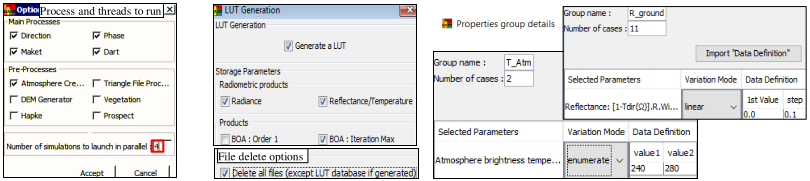
*Sequence "Seq_ground" with 2 groups: $\rho_{ground}$ from 0 to 1 with step=0.1, and $T_{atm}=240K$ and $280K$.*
</img>

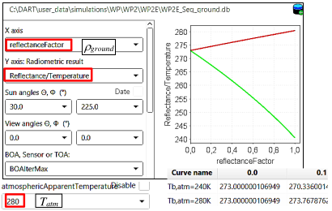
*LUT display: $T_{B}(\rho_{ground}, T_{atm})$, with the selection of fixed and free parameters. The values of each curve are shown.*
</img>

#### 5.b - Detecting a fire in a pixel, depending on the fire area: WP2F (CT=8")

<u>*Objective:*</u> what pixel fraction a fire must cover to be detected by a low flying sensor (10m pixel size; 2 TIR bands: $3\mu m$, $10\mu m$, $\Delta \lambda=0$), knowing that it is detected only if $T_{B,scene} > T_{B,ground} +40K$?

- Scene: 10m x 10m ($\Delta x,y=\Delta z=1m$. No product, apart the added nadir image for DART-Lux. No atmosphere RT. $T_{B,atm}=280K$}. The fire is simulated by a 1m x 1m imported 3D object (square: `square.obj`), located slightly above the ground (e.g., 0.01m) in order not to confuse it with the ground (see below). $T_{ground} = 300K$, $T_{fire} =500K$, $\rho_{fire}= \rho_{ground} =0$.

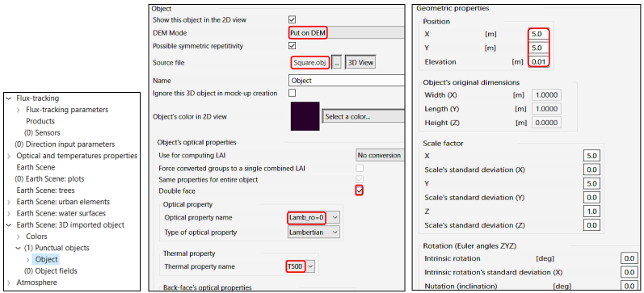
*Importation of the 3D object "square". a) Setting reflectance and temperature. b) Setting geometry.*
</img>

- <u>*Sequence:*</u> 33 simulations with scale factors of the `square.obj` sides {$a_x \in [1 \:3]$, $a_y \in [0\: 10]$, $\Delta a_x= \Delta a_y=1$} in distinct groups (see below). The LUT stores $T_{B,scene}(fire \;area\; A_{fire}=a_x.a_y)$ (see below). It can be exported as a `csv` file.

!!!question
    What is the smaller detectable fire area, with 1% precision in terms of area?
!!!question
    Why detection is better at $3\mu m$ than at $10\mu m$?

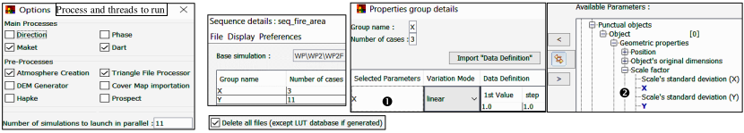
*2 groups (X, Y) sequence that varies the area of the imported square.*
</img>

Menu "Process and threads to run": set "Triangle File Processor" because each simulation modifies a 3D object made of triangles; "Direction" and "Phase" can be unset if the DART root simulation already computed DART directions and phase products since the sequence does not modify DART directions and Phase products.
  A click on a selected parameter (), followed by a click on , highlights the selected "availailable parameter" ().

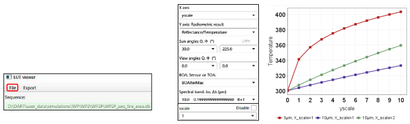
*$T_B(y \:scale)$ for $\lambda=3\mu m$ with x scale = 1, and $10\mu m$, with x scale = 1 and 2.*
</img>

#### 5.c - Detecting a fire area, depending on its temperature: WP2G (CT=11")

<u>*Simulation*</u>: $100m^2$ scene with a $1m^2$ fire. $T_{ground} = 300K$, $\rho_{fire} = \rho_{ground} = 0$. $T_{atm} = 280K$.

<u>*Sequence*</u>: $T_{fire}$ increases from 300K with $\Delta T_{fire} =20K$ and $N_{steps}=40$.

!!!question
    Above which Temperature of fire $T_{fire}$ the fire is detected at $10\mu m$ and $3\mu m$ (detection threshold $\Delta T=40K$)?

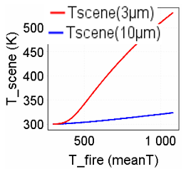
*$T_{B,scene}(T_{fire})$. $\lambda=3\mu m$, $10\mu m$*
</img>

### 6) Stephan Boltzmann law vs. Planck law: WP2H

<u>*Objective:*</u> to test DART simulation of Boltzmann law for 2 spectral ranges ([$1\mu m \:99\mu m$], [$1\mu m \:201\mu m$]).

<u>*Theory :*</u> thermal exitance $M_g =\epsilon_g.\sigma.T_g^4=\pi.\int_{0}^{\infty} \epsilon_g(\lambda).L_B(\lambda,T).d\lambda$ with $\epsilon_g=\frac {\int_{0}^{\infty} \epsilon_g(\lambda).L_B(\lambda,T).d\lambda} {\int_{0}^{\infty} L_B(\lambda,T).d\lambda} = \frac {\pi.\int_{0}^{\infty} \epsilon_g(\lambda).L_B(\lambda,T).d\lambda} {\sigma.T_g^4}$ and Planck radiance $L_B(\lambda,T)$. For a perfectly emitting surface (i.e. black body): $\epsilon=1, M(T=300K)=459.3W/m^2$.

Scene {$\Delta X=\Delta Y=1m$, $\Delta x = \Delta y= \Delta z= 1m$, $T_g=300K$, $\rho_g(\lambda) =0$, No atmosphere RT, $T_{atm}=0K$} with 3 configurations:

#### 6.a - Mono-band simulation 
{mode T, [$\lambda_{min} \:\lambda_{max}$], option "Boltzmann"} (see below) (CT=1")

$M_g =459.3W/m^2$ (cf. `dart.txt` file) is exact. DART band ($\overline{\lambda}=50\mu m, \Delta \lambda=98\mu m$) is only used for computing $\epsilon_g$. Here, it is useless since $\rho_g$, and consequently $\epsilon_g$, are spectral constant. Hence, DART bandwidth should be correctly specified if $\epsilon_g$ (i.e., $\rho_g$) varies with $\lambda$.

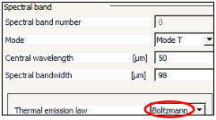
*Mode T with Boltzmann option.*
</img>

#### 6.b - Mono-band simulation {Mode T + option "Planck}

Spectral range $[1\mu m \:99\mu m]$: $M_g(\lambda) = 4.664125 W/m^2/\mu m$ (cf. `dart.txt` file) $\implies M_g = 457.1 W/m^2$

Spectral range [$1\mu m \:201\mu m$]: $M_g(\lambda) = 2.29508 W/m^2/\mu m$ (cf. `dart.txt` file) $\implies M_g = 459 W/m^2$

#### 6.c - Multi-band simulation {Mode T + option "Planck"}

The mono-band approach becomes inaccurate if $\epsilon_g$ varies with $\lambda$. Then, the solution is to divide the spectral domain into N spectral bands, and to apply the 'BroadBand' tool to these N bands. Here, the accuracy in term of N is assessed for a grass cover (spectral property: grass_rye), with $T_{atm} = 0K$ and with N = {1, 10, 100, 1000}.

!!! warning
    Canstant bandwidth is not optimal: spectral sampling should be denser at Max{$\epsilon_g(\lambda).L_B(\lambda,T)$}

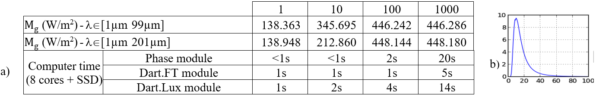
*a) $M_g(\lambda \in [1\mu m \:99\mu m])$ of a grass cover simulated with 1, 10, 102, 103 bands. b) $M_{ground}(\lambda)$.*
</img>

### 7) Sun radiation reflected by the Earth vs. Thermal emission of the Earth: WP2I

<u>*Objective:*</u> to assess the wavelength $\lambda_{threshold}$ where sun induced Earth exitance $M_{BOA,sun}(\lambda)$ = Earth thermal exitance $M_{BOA,thermal}(\lambda)$. This is done by comparing $M_{BOA,sun}(\lambda)$ and $M_{BOA,thermal}(\lambda)$, for $\rho_{ground}=0.01$, $0.1$ and $0.5$.

<u>*Scene:*</u> $T_g=300K$, $T_{atm}=280K$, $\theta_s=30°$. [$2\ :5\mu m$], $\Delta \lambda=30nm$. USSTD gas model. Rural V23 aerosol. Analytic model.

- Run a sequence on $\rho_{ground}(0.01, 0.1, 0.5)$ with 100 bands in mode (R) and also in mode (T), over [$2\mu m \:5\mu m$].

- Plot $M_{BOA,sun}(\lambda)$ and $M_{BOA,thermal}(\lambda)$ (i.e., exitance M in mode (R) and (T)) with the LUT viewer.

!!!question
    $\lambda_{threshold}$ depends on $\rho_{ground}$ (see below): $\rho_{ground}= 0.01, 0.1, 0.5 \implies \lambda_{threshold} =2.495\mu m,3.575\mu m, 4.115\mu m.$
!!!question
    $\lambda_{threshold}$ changes during the day. Why? How?

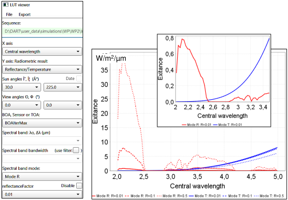
*BOA exitance: reflexion of sun radiation (red) and thermal emission (blue). $\rho_{ground}=0.01$, 0.1 and 0.5. The inner graph is a zoom for $\rho_{ground}=0.01$.*
</img>

