<u>*Objective:*</u> 

- To understand how the 3D geometry of a scene impacts its observed reflectance $\rho^{*}$ (e.g., a 3D scene made of lambertian elements is usually not lambertian). For that, we analyze images at scattering order 1 and "infinite" (i.e., infinite extrapolation using last DART-FT iterations, stored in folder ITERX, or very high DART-Lux scattering order). Note: {slope ($\overline{\Omega}_{slope},\rho_{slope}$), sun direction $\overline{\Omega}_s$} $\implies \rho_1^{*} = \rho_{slope}.\frac {\bar{\Omega}_s.\bar{\Omega}_{slope}} {\bar{\Omega}_s.\bar{\Omega}_{ground}} = \rho_{slope}.\frac{E_{slope}}{E_{BOA}}$
- To create color composites and linear combinations of spectral images.
- To simulate satellite images with the option "atmosphere radiative transfer".
- To simulate polarization (cf. theory in DART Handbook).

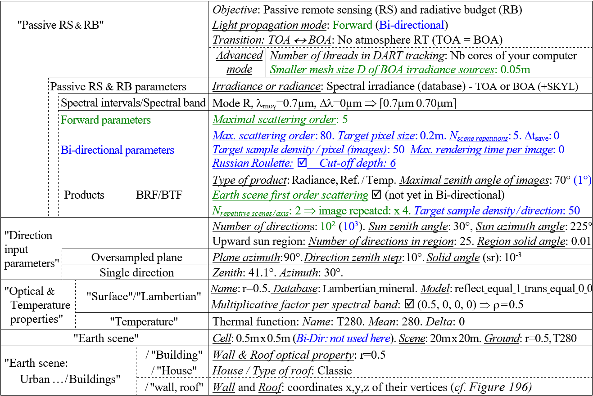
*Parameters including those specific to "Forward" (DART-FT) and "Bi-directional" (DART-Lux) sub-modes..*
</img>

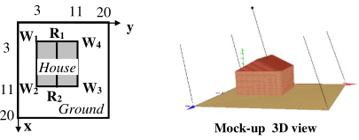
*"Classic" house in a 20mx20m scene.*
</img>

The house geometry is set by points that are input in a anticlockwise direction: 4 points ($W_1, W_2, W_3, W_4$) for the walls and 2 points ($R_1, R_2$), for the roof.

Height of walls: 4m. Height of the roof ridge: 6m.

### 1) First and multiple scattering order reflectance images of a urban scene: WP3A (CT=4")

<u>*Objective:*</u> to understand the differences between 1st and infinite scattering order images.

DART-Lux and DART-FT (D=0.05cm) nadir reflectance images $\rho_{xy}$ and mean values $\overline{\rho}$ are very close (Figure below)

- DART-Lux:  $N_{sample}=200 : \bar{\rho} \approx 0.473$.  $N_{sample} = N_{cores} = 1$ : few samples $\implies$ noisier image but same $\bar{\rho}$.
!!!question
    Why $N_{cores}=1$?

- DART-FT:  Here, we stress the role of the illumination mesh size D, using D=0.5cm (i.e., 1 ray / cell). Then, roof irradiance $E_{roof}$ is spatially periodic, and so $\rho_{1,roof}^*$ , since $\rho_{1,roof}^* = \rho_{roof}.\frac{E_{roof}}{E_{BOA}}$ . Then: $\rho_{roof} \in [0.02  0.9]$ with $\overline{\rho}=0.474$. 

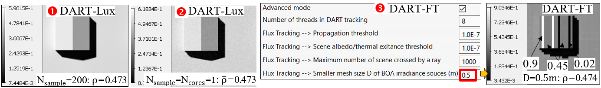
*DART image accuracy. DART-Lux:  $N_{sample}=200$ : $\overline{\rho}=0.473$ and  $N_{sample} = N_{cores} = 1$ :$\overline{\rho}=0.473$.  DART-FT: periodic $\rho_{slope}$ from 0.02 to 0.9 due to the coarse scene illumination mesh D=0.5cm (i.e., 1 ray / cell).*
</img>

***Display 1st scattering order DART-FT images (i.e., folder order1):***

For this schematic scene, DART-Lux is slower than DART-FT, especially if many images are requested In addition, up to now, conversely to DART-FT, it must be run twice with $N_{scattering} = 1$ and large value to get images at order 1 and infinite. The image below shows DART-FT images for nadir, viewing direction ($\theta_v = 41.1°$, $\phi_v = 30°$) and ($\phi_v = 90°$ with $\theta_v = 10°$,…, 70°. In any displayed image, the tools (, create , store , open ) of the "Mask Editor" ([here](../../DART_functionalities_and_products/6-View_menu/6.1/view_scene_2d_3d.md)) allow one to define sub-regions and to compute their mean reflectance value.

!!!question
    Why irradiated ground has a constant reflectance, and why does the shadow have a zero reflectance?
!!!question
    Why does each roof slope have the same reflectance for any viewing direction (see below)?
!!!question
    Each roof slope has a specific order 1 reflectance : $\overline{\rho}_{1, most\:lit\:shape}=0.537$, $\overline{\rho}_{1, least\:lit\:shape}=0.356$. Why?
!!!note
    $|\Omega_s \Omega_{slope}|=|cos(\theta_s)|.|cos(\theta_{slope})| + |sin(\theta_s)|.|sin(\theta_{slope})|.cos(\phi_s - \phi_{slope})$ and $|\Omega_s \Omega_{ground}| = |cos(\theta_s)|$

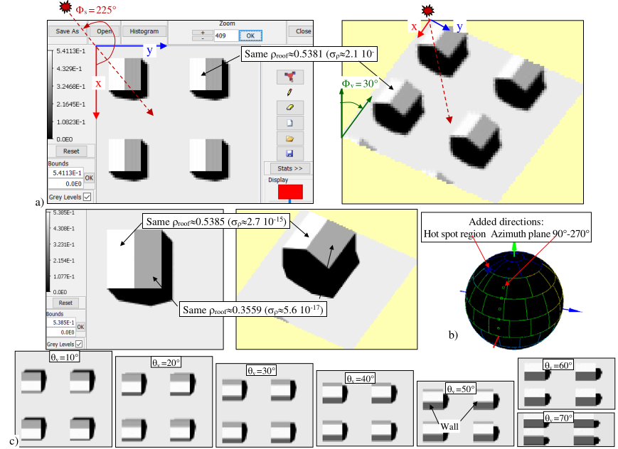
*DART-FT order 1 images. a) Images at nadir and viewing direction $(\theta_v = 41.1°, \phi_v = 30°$). b) Added directions. c) Images for ($\phi_v = 90°$ with $\theta_v = 10°$,…, 70°. The theoretical slope reflectance is 0.5385 and 0.3559 (cf. `WP3A.xlsx`).*
</img>

***Display infinite scattering order nadir and oblique*** ($\theta_v= 41.1°, \phi_v = 30°$) ***images*** (see below; (i.e., folder ITERX)
!!!question
    The irradiated ground has a reflectance that depends on location (x, y). Why?
!!!question
    $\rho_{roof}$ is nearly isotropic, conversely to $\rho_{scene}$. Why?
!!!question
    Neighborhood increases $\rho_{scene}^{DART-Lux}$ : $\rho_{well \:sunlit \:roof} = 0.542$ if $N_{scene \:repetition} = 5$ and $0.546$ if $N_{scene \:repetition} =1$ Why?

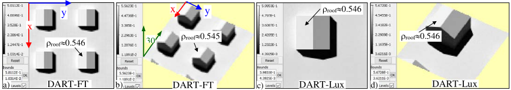
*DART infinite scattering order images. a,c) Nadir. b,d) Oblique direction: $\theta_v = 41.1°, \phi_v = 30°$. a,b) DART-FT (IterX). c,d) DART-Lux ($N_{scattering \:order} = 20, N_{scene \:repetition} = 5, \Delta r=0.2m$).*
</img>

***Display the angular variation of the scene reflectance***

- 1D / 2D reflectance graphs (see the images a. and b. below) display the directional behavior of $\rho_{scene}$.

!!!question
    $\rho_{scene}$ is not lambertian (i.e., anisotropic), whereas all scene elements are lambertian. Why?

!!!question
    $\rho_{scene}$ is maximal for the hot spot direction (Figure below .a). Why?

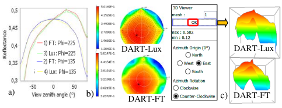
*$\rho_{scene}(\theta,\phi)$ a) 1D plot: solar $(\phi_v=225°)$ & perpendicular $(\phi_v=135°)$ planes. b,c) DART-FT and DART-Lux 2D & 3D plots. They slightly differ because their numbers of upward directions differ. 102 for DART-FT and 360x90 for DART-Lux.*
</img>

!!!note
    DART-FT "order 1" is much faster using options  and  (Figure below). DART-Lux "order 1" is with $N_{scattering} = 1$.

*Fast  and very fast  1st order mode.  is faster.*
</img>

### 2) Components of the simulated signal, per type of scene element: WP3B-FT, WP3B-Lux (CT=1")

<u>*Objective:*</u> to get image per type of surface element (e.g., wall) such that "DART image" = $Image_{ground} + Image_{roof} + Image_{wall}$

<u>*Editor: *</u> set the option `Image decomposition` in `Product` menu.   To reduce CT: only simulate images with $\theta_v <1$, and do not simulate "1st order" (DART-FT), and BRF (DART-Lux).

***Display element images.*** In the menu `View images`, set the correct directory / folder (`output/PerSceneElements`)
(see the image b. below) or search directly the element images with the option "Search Image" or "Open".

!!!question
    Verify that the roof has the same reflectance in the "roof image" and in the "total image".

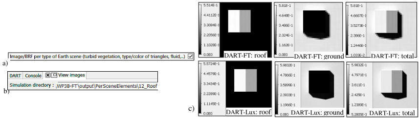
*DART component images. a) Product, b) Display menus. c) DART-FT and DART-Lux Roof, Ground and Total images.*
</img>

### 3) Time series of scene reflectance $\rho_{scene}$: WP3C

<u>*Objective:*</u> $\rho_{scene}$ variation with sun direction $(\theta_s, \phi_s)$, for the nadir and $(\theta_v=61°, \phi_v=22°)$ viewing directions.

<u>*Editor:*</u>

- TOA $\leftrightarrow$ BOA transfert: Analytic model
- TOA illuumination: Spectral irradiance (database).
- Results: only in the LUT (i.e., unset 'No product'), and images for the 2 added directions {Nadir, $(\theta_v=61°,\phi_v=22°)$}

Two methods are used to vary sun direction: $\theta_s$ change with constant $\phi_s$, and realistic ($\theta_s(t), \phi_s(t)$) with time t.

**a) Sequence {$\theta_s: 0 \rightarrow 80°, \Delta \theta_s = 10°; \phi_s = 225°; \Delta x=0.2m$} (see below): WP3Da-FT (CT=30"), WP3Da-Lux (CT=35")**

!!! note
    To view the images of a simulation of a sequence, use 
    
!!!question
    $\rho_{scene}$ varies with viewing directions, and nadir $\rho_{scene}$ decreases if $\theta_s$ increases. Why?

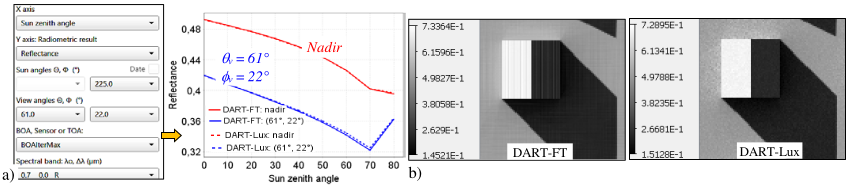
*DART-FT & DART-Lux $\rho_{scene}(\theta_s)$. a) LUT display: $\rho_{scene}(\theta_s, \phi_s=225°)$ for 2 viewing directions (nadir; ($\theta_v=61°, \phi_v=22°$)). b) DART nadir images for $\theta_s=70°$. Note DART-FT discrete illumination & DART-Lux Monte Carlo noise. $N_{scene\:repetition}^{DART-Lux} is as large as 50 because the scene is small and some sun and viewing directions are very oblique.*
</img>

**b) Sequence {time: 5h $\rightarrow$ 19h, $\Delta t = 1h; \Delta x=\Delta y=0.2m$} (see below): WP3Db-FT (CT=12s), WP3Db-Lux (CT=36s)**

Here, the sequence varies 'time' because it is usually more convenient, and realistic, than to vary ($\theta_s, \phi_s$). For that:

- Set the scene coordinates in the root simulation. For Toulouse (see the image a. below): 43°36'N, 1°26'E, 200m altitude.

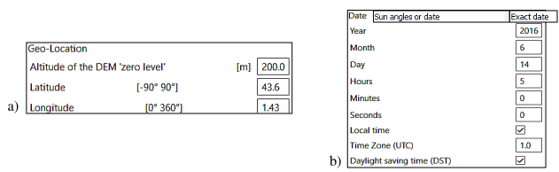
*a) Coordinates (Toulouse). b) Time.*
</img>

- Set: the Date mode in the root simulation with June 14, 2016, then, the range of dates in the sequencer (see below).
- Create the 'time" sequence (see below).

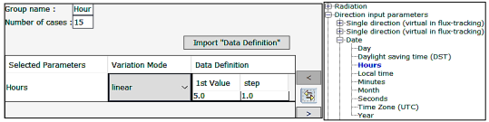
*Setting 15 time steps of 1h time over [5h 19h] in the sequence. displays the selected parameter "Hours" in the right panel*
</img>

see below shows DART-FT and DART-Lux images at 5 hours for atmosphere RT simulated with DART *"Analytic model"* and *"Atmosphere RT"*. The latter gives the most accurate BOA illumination (i.e., downward radiance) and is the only mode to give TOA products. ρscene varies from 5 to 12 am (see below) as the nadir viewed area of shadows: minimal at sunrise and sunset (maximal shadow extent) and maximal at 12 am (minimal shadow extent).

!!! note
    For very simple landscapes, DART-FT is usually faster than DART-Lux.

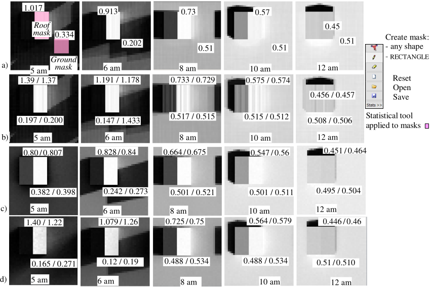
*Time series (5, 6, 8, 10, 12 am) of DART-FT (a,b) and DART-Lux (c,d) nadir reflectance images. Atmosphere mode: a,c) Analytical; b,d) RT. Reflectance of the roof East side and a ground zone are indicated.*
</img>

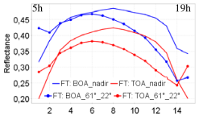
*DART-FT ρscene,BOA and ρscene,TOA time series (5h $\rightarrow$ 19h) for 2 viewing directions: nadir and (61°, 22°). Ox axis is the "Exact date" (i.e., "hour") index.*
</img>

### 4) TOA, sensor and BOA spectra: WP3E-FT (CT=37s), WP3E-Lux (CT=53s)

<u>*Objective:*</u> TOA / BOA radiance spectra of a 1m x 1m grass scene $(\Delta x=1m, \rho_{ground}=$`grass_rye`, $T_{ground}=280K)$.

<u>*Multi-band simulation*</u> (see below): 113 bands to limit CT. 53 bands in $[0.35 \:3\mu m]$ ($\Delta \lambda=50nm$, mode R), 60 in $[3 \:15\mu m]$ ($\Delta \lambda=200nm$, mode T).  
Atmosphere: USSTD76 gas, Rural23 aerosol, 'Manual' geometry: Mid Atmosphere [0km 4km] (1km layers), High Atmosphere [4 80km] (5km layers), and Sensor altitude: 3200m. No product apart LUT (radiance and BRF-BTF, atmosphere TOA).

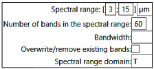
*Creation of the T bands*
</img>

!!!question
    Long waves: explain the smooth curve $L_{BOA}$, the minima of $L_{TOA}$ and the maxima of $L_{atm}$. Why $L_{sensor} \approx L_{BOA}$?
!!!question
    $L_{TOA} \gg L_{BOA}$ at $0.4-0.6\mu m$. Why? Above which $\lambda$, $L_{thermal} > L_{sun\:reflection}$, at BOA level, and at TOA level?

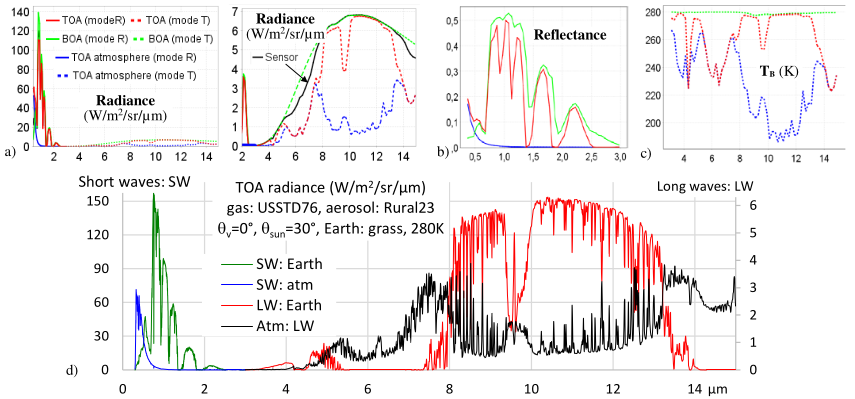
*TOA/BOA scene and TOA atmosphere spectra. a) LUT radiance $[0.35; \:15\mu m]$ and zoom over $[2 \:15\mu m]$. b) LUT reflectance $[0.35; \:3\mu m]$. c) LUT brightness temperature $[3; \:15\mu m]$. d) LUT export (csv file): scene and atmosphere TOA radiance; $[0.35; \:3\mu m]$, $\Delta \lambda=2nm$: sun radiation scattered by the atmosphere and the Earth (attenuated by the atmosphere); $[3; \:15\mu m]$, $\Delta \lambda=10nm$: atmosphere thermal radiance and Earth thermal radiance attenuated by the atmosphere.*
</img>

### 5) SKYL, spectral indices and Color composite: WP3F-FT (CT=3s) and WP3F-Lux (CT=10s)

<u>*Objective:*</u> SKYL and spectral indices for nadir and ($\theta_v=61°,\phi_v=22°$) viewing directions, plus RGB color composite.

**Simulation** (copy of WP3Da): 4 bands $(0.45\mu m, 0.55\mu m, 0.65\mu m, 0.9\mu m; \Delta \lambda=0\mu m)$. $\theta_s=30°, \phi_s=225°$. $\rho_{ground} =$ `grass_rye`, $\rho_{roof} =$ `tile_Capitoul`, $\rho_{wall} =$ `concrete_brown`. Atmosphere RT. DART-FT: 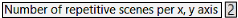

**Create RGB color composites:** BOA, Sensor and TOA blue/green/red nadir images (see below)

!!!question
    The ground and roof observed reflectance values change between BOA and TOA (see below). Why?
!!!question
    The SKYL value decreases if the visibility and / or wavelength increase (see the table below). Why?

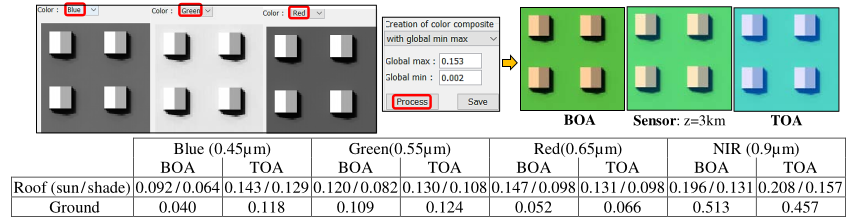
*DART color composites: (tool 'DART / Tools / Color composite'). 3 altitudes (a: BOA. b: Sensor (3km). c: TOA) with indication of the spectral TOA and BOA reflectance of the roof and ground.*
</img>

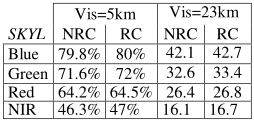
*$SKYL_{DART-FT}$ for 2 aerosol visibilities.*
</img>

BOA diffuse sun irradiance, and therefore SKYL, includes direct sun radiation that is scattered along the direct sun direction. SKYL is stored in dart.txt, with radiative coupling (RC) and without (NRC).

**Compute TOA / BOA vegetation index** $NDVI= \frac {\rho_{NIR} - \rho_{red}} {\rho_{NIR} + \rho_{red}}$ (see below) with the tool `Tools / Band calculation tools / Band Math`. Use the pre-defined NDVI expression or type its expression by applying basic math operators (+, -, *, /, >,…) to DART spectral images. Results are stored in folder "BandCombination", at folder "output" level.

!!!question
    $NDVI_{BOA,grass,sunlit} > NDVI_{BOA,grass, shadow} \gg NDVI_{TOA,roof}$. Why?
!!!question
    Roof and shadow: $NDVI_{TOA} > NDVI_{BOA}$. It is the opposite for grass. Why?

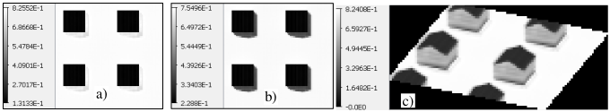
*NDVI images. a) Nadir BOA b) Nadir TOA c) Oblique TOA*
</img>

### 6) Impact of sky illumination on scene reflectance: WP3G (1s)

<u>*Objective:*</u> dependence of $\rho_{scene}$ on the $SKYL = \frac {E_{BOA,diff}} {E_{BOA}}$, and also on the number of discrete directions $N_{dir}^{\downarrow}$ for DART-FT.

<u>*Simulation:*</u> copy of WP3F, with $\lambda=0.45\mu m$ only. Atmosphere "analytic model"  
The image below illustrates the dependence of ρscene for SKYL=0 (a), and SKYL=1 with $N_{dir}^{\downarrow} =50$ (b) and $N_{dir}^{\downarrow} =20$ (c).

!!!question
    There is no such effect with DART-Lux. Why?
!!!question
    SKYL = 0: $N_{dir}$ impacts the image radiometry only for scattering orders larger than 1.
!!!question
    SKYL = 1:
      - the 2 roof slopes have the same reflectance. Why?
      - minimal values are much larger than those with "SKYL=0". Why?
      - $\rho_{ground}^{SKYL=1} < \rho_{ground}^{SKYL=0}$ in the central part of the image. Why?
      - ground radiance is smaller close to walls than far from walls (see the image b. below). Why?

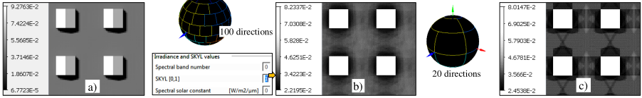
*Impact of SKYL and $N_{dir}$ discrete directions on $\rho_{scene}$. $\lambda=0.45\mu m$. $\theta_v=0°$. a) SKYL= 0: $\rho_{scene} \in [0;\: 0.093]$. b) SKYL=1, $N_{dir}=100$: $\rho_{scene} \in [0.02;\:2 0.082]$. c) SKYL=1, $N_{dir}=20$: $\rho_{scene} \in [0.025;\: 0.080]$*
</img>

### 7s) Specular reflectance and polarization: WP3H (CT=24')

<u>*Objective:*</u> multi-spectral specular polarized reflectance images of a 3D scene (see below).

<u>*Simulation:*</u> 60 x 60m, $\Delta r=0.25m$. Flooded ground: lambertian + "Basic" specular ("like Gaussian" option, intensity x 0.4). 4 bands (mode R: 0.4 / 0.55 / 0.7 / 1$\mu m$). 3D trees: cherry, citrus. Direct sun $(\theta_s=30°, \phi_s=225°)$ only (SKYL=0) to better stress the polarization.

!!!note
    - any ground surface has the same specular configuration in satellite images $(\Delta \Omega_v=0)$, conversely to camera images where only part of it is in the specular configuration.
    - to simulate specular reflectance, set:  in advanced mode.

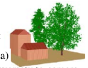</img>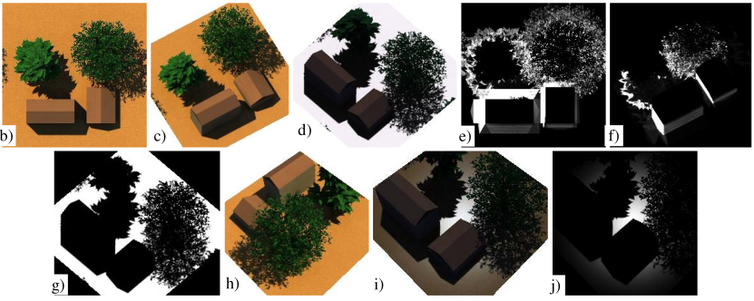
*BOA total (RGB color composite)/polarized images. Nadir / oblique /specular directions. $\theta_s=30°, \phi_s=225°$.*
</img>

- Satellite $(\Delta \Omega_v=0)$. 
    - Reflectance images: b) nadir, c) oblique (22.4°, 330°), d) specular direction (30°, 45°).
    - Band 1 polarized reflectance image (Q Stokes element): e) nadir: $\rho_1=0$, $\rho_{max}=4.9\times 10^{-7}$; f) oblique (22.4°, 330°): $\rho_1=0$, $\rho_{max}=1.7\times 10^{-4}$. g) Oblique specular direction (30°, 45°): $\rho_1 \approx \rho_{max}=2.8\times 10^{-1}$.
- Camera $(\Delta \Omega_v \neq 0)$, 30° inclined: h) Non specular. i, j) Specular: total and polarized reflectance.

### 8) House reflectance and spatial resolution: WP3I

Objective: how do spatial resolution $\Delta r$, illumination mesh $\Delta r_{illum}$ and computer time $\Delta t$ impact $\rho_{BOA}$ (see below)?
Here: analytic atmosphere model. $\lambda = 0.4, 055, 0.675\mu m$.

- DART-FT: $\Delta t$, RAM and hard disk greatly change with $\Delta r$ and $\Delta r_{illum}$. $\rho_{BOA}$ is accurate even with coarse $\Delta r$.
- DART-Lux: $\Delta r=5cm$. $\rho_{BOA}$ accuracy increases with $\Delta t$. If $\Delta t=20s$, $\rho_{BOA}$ relative error $<4\times 10^{-5}$, but the image is noisy.  
Conversely to DART-FT, its RAM (0.4Gb) does not depend on $\Delta r$ and $\Delta t$ is multiplied by n if n images are simulated.

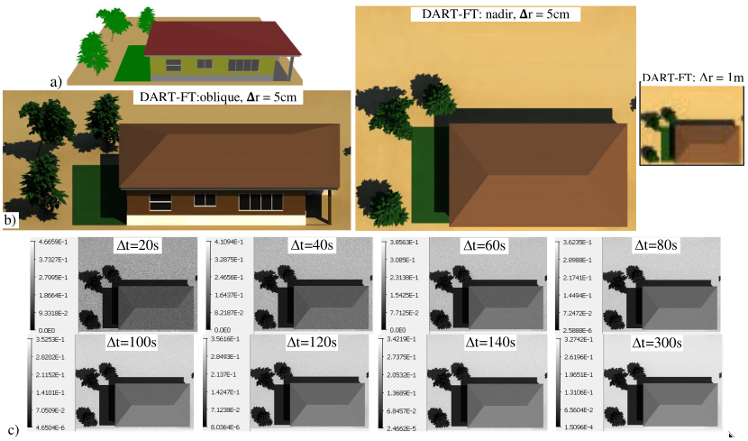</img>

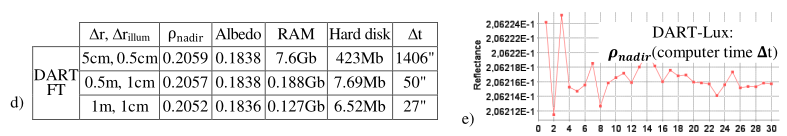
*a) Scene. b) DART-FT images: oblique and nadir for $\Delta r=5cm$ and nadir for $\Delta r=1m$ ($\implies \Delta t$ is divided by 10). c) DART-Lux images for $\Delta r=5cm$. 675nm. d) DART-FT with $\Delta r$ and $\Delta r_{illum}$. e) DART-Lux $\rho_{675nm}$ with increasing $\Delta t$*
</img>

### 9) BOA/TOA images of a landscape: WP3J (CT: 78")

<u>*Objective:*</u> TOA/BOA images of a 100mx100m scene. 

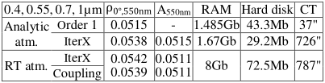
*BOA ρnadir and albedo. Atmosphere RT and analytical model, and 1st order. $\lambda=0.55\mu m$*
</img>

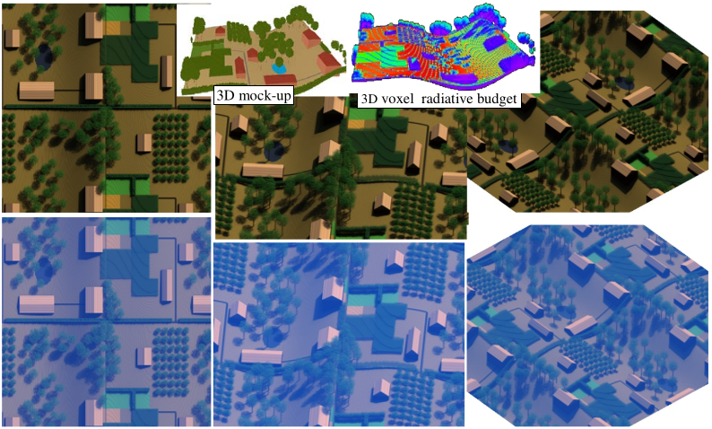
*BOA / TOA DART images of countryside. $\Delta r=0.5m$. DEM $z(x,y)=H.[sin(\frac {y} {y_{max}}.\frac {5\pi} {2}).\frac {y} {y_{max}} + 0.7][1+cos(\frac {x} {x_{max}}.\frac {\pi} {2})]$*
</img>

