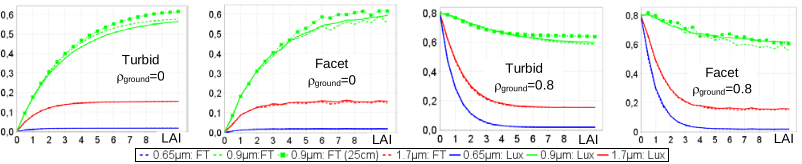

<u>*Objective:*</u> RB and SIF of 3D and 1D facet- and turbid-vegetation with DART-Lux and DART-FT.

*Parameters including those specific to "Forward" (DART-FT) and "Bi-directional" (DART-Lux) sub-modes.*
</img>

!!!note
    - RB: it s mostly simulated with DART-FT because DART-Lux is advised only if RB data are for part of the scene.
    - RS data: DART-Lux is usually preferred to DART-FT except for schematic scenes as here. For mock-ups with turbid cells, DART-FT decreases if $LAI_{cell} > 0.5$, especially for large scattering bands (note: if needed, decrease $LAI_{cell}$ by decreasing the cell vertical dimension $\Delta z$). Here, canopy height = 1m; then, although too large for {DART-FT, LAI >2}, we use $\Delta z=0.25m$ because it leads to only 4 DART-FT canopy layers, which is convenient to display the RB.
    - Running sequences with the option "Delete all files except LUT" reduces the needed hard disk memory.

### 1) Vegetation spectral reflectance as a function of LAI 
($m^2$ leaves/ $m^2$ ground): WP4A_FT and WP4_Lux

<u>*Objective:*</u> DART-FT and DART-Lux $\rho_{scene}(LAI; \rho_{ground}=0$ and 0.8) of 1m high vegetation canopy simulated as turbid medium and $0.003m^2$ facets (see below).

*1m high turbid and equivalent facet canopy. a) DART-FT. b) DART-Lux. c) Leaf deciduous optical properties.*
</img>

**DART_Lux: influence of input parameters** (sequence `seq_Repeat_Scat_Sample_LAI.xml`): $CT_{facets} = 8$', $CT_{turbid} = 18$'

DART-Lux input parameters are fewer than for DART-FT (e.g., $N_{sub-cell}, N_{sub-face}, N_{iterations}, \Delta l_{illumation}$). The figure below shows how its 3 major parameters ($N_{repetitive}, N_{scat}, N_{sample}$: numbers of scene repetitions, scatterings and samples) impact $\rho_{scene,0.65\mu m}$ and $\rho_{scene,0.9\mu m}(N_{repetitive}: 0, 2, 4,…, 20$) for $N_{scat}$ = {5, 10, 20, 50, 80}, $N_{sample}$ = {500, $5 \times10^4, 5 \times10^5$}, LAI = {2, 8}, $\rho_{ground}=0$, for turbid and facet scenes. $\rho_{scene}(N_{repetitive} = 20, N_{scat} = 80, N_{sample} = 5\times 10^5$) is the reference:

</img>

1. $N_{repetitive}$ (0 $\iff$ isolated scene). Rays onto the 4 scene vertical sides influence $\rho_{scene}$, in addition to rays  onto the scene top. Their role decreases with smaller sun zenith angle, and larger scene dimensions, LAI and $\rho_{ground}$:
    - Sun / atmosphere rays  incident onto the vertical sides of the scene ($N_{repetitive} = 0$) or the outer repeated scenes, and transmitted through the repeated scenes ($N_{repetitive}> 0$). Their influence decreases if $N_{repetitive}$ increases.
    - Rays  onto the tops of the repeated scenes, and transmitted through the repeated scenes ($N_{repetitive} > 0$). Their influence decreases if $N_{repetitive}$ increases.
    - Rays  scattered by the repeated scenes, due to intercepted rays  (lesser role if $N_{repetitive}$ increases) and  (lesser role if $N_{repetitive}$ increases).  
For this very small scene, $\rho_{scene}(N_{repetitive})$ decreases and converges for $N_{repetitive} \approx 3$ at $0.65\mu m$, whereas it increases at $0.9\mu m$ and converges at $N_{repetitive} \approx 6$ at $0.9\mu m$. For large scenes, the default option $N_{repetitive} = 1$ is usually advised.
2. $N_{sample}$. The MC noise of $\rho_{scene}$ decreases if $N_{samples} \times N_{pixels}$ of DART image increases ($\implies$ it is smaller for $N_{sample}=5\times 10^5$).
3. $N_{scat}$ ($\equiv N_{iterations}$ in DART-FT). $\rho_{scene}$ has converged (i.e., $\frac {\Delta \rho} {\rho} < 2\times 10^{-3}$) for $N_{scat} \approx 5$ at $0.65\mu m$ and $\approx 40$ at $0.9\mu m$.

*DART-Lux $\rho_{scene}(N_{repetitive}, \theta_v = 0°): N_{scat}$ = {5, 10, 20, 50, 80}, $N_{sample} =$ {5 103, 105, 5 105}, $SKYL_{0.65\mu m}=0.24$, $SKYL_{0.9\mu m}=0.14$, $\theta_s=30°$. $\rho_{scene,turbid}$ and $\rho_{scene,facet}$ slightly differ because facets are large (i.e., $0.003m^2$). $\rho_{ground}=0$.*
</img>

**$\rho_{scene,\lambda}$(LAI: [0 10], step = 0.5; $\rho_{ground}=0$; 0.8)** (sequence `seq_LAI.xml`) for turbid and facet scenes: $CT_{facets}^{DART_Lux}= 8'$
$\rho_{scene,\lambda}^{DART-FT}(LAI)$ and $\rho_{scene,\lambda}^{DART-Lux}(LAI)$ at $\lambda =$ {0.65, 0.9, $1.7\mu m$} (see below) slightly differ due to differences in RT algorithms and input parameters. Here, the small size of the scene reinforces the differences and fluctuations.

- DART-Lux: $N_{scat} = 50, N_{sample} = 5\times 10^5$, $N_{repetitive} = 10$. Pixel size = 1m. $N_{scat}$ could be smaller, especially for 0.65 and $1.7\mu m$. $N_{repetitive}$ is larger than the default value (i.e., 1) because the scene is very small.
- DART-FT: $\Delta z = 25cm$ and 1cm, $\Delta x = \Delta y = 1m$ for turbid and 0.1m for facet, $\Delta_{illu} = 0.01m$. Cell dimensions impact $\rho_{scene}$ through the grouping of rays that exit cells: the larger the cells, the greater the fluctuations in $\rho_{scene}$.

- $\rho_{scene,0.9\mu m} > \rho_{scene,1.7\mu m} > \rho_{scene,0.65\mu m} \forall \rho_{ground}$, for turbid- and facet-vegetation. Why?

*$\rho_{scene}(LAI, \theta_v = 0°)$ at 0.65, $0.9\mu m$ and $1.7\mu m$. $\rho_{ground}=0$ and 0.8. Turbid and facet.*
</img>

### 2) Radiative budget (RB) of a 1D homogeneous vegetation canopy the short waves: WP4B

<u>*Objective:*</u> $RB_{cell,\Delta \lambda}$ and $RB_{facet,\Delta \lambda}$ products of a turbid plot (cf. section b) at increasing scattering orders for DART-FT.

<u>*Scene:*</u> 1m x 1m $(\Delta x=\Delta y=1m; \Delta z=0.25m)$, ground ($\rho_{ground}= 0.5$), turbid vegetation plot (LAI=2, h=1m, $\rho_{leaf\ deciduous}$), 2 bands (0.55 and $0.9\mu m$, $\Delta \lambda=0$; mode R). "Radiation Budget Products' is the only product (see the image a. below). Most results are for DART-FT because for RB, DART-Lux becomes efficient only if part of the scene RB is simulated.

**WP4B-FT** (1s): select the products to store (see below), run the simulation, then check the top scene and 1D RB

1. <u>Top scene RB:</u> irradiance, exitance and albedo; check that their values in file dart.txt are those in the table below.
2. <u>1D $RB_{\lambda}$</u> (see the table below; unit % of top scene irradiance): profile of intercepted, emitted, scattered and absorbed radiation per iteration, layer z and band. Here, 3D $RB_{\lambda}$ (RadiativeBudget_3D) = 1D $RB_{\lambda}$ (RadiativeBudget_profile) because the scene horizontal section is a single cell. The interception profile decreases exponentially with height, except in the lower layer [0 0.25m] where it increases because this layer contains "Vegetation(i.e., Turbid) + Ground".

!!! note
    RB_3D_Turbid (file RadiativeBudget 3D) = RB_3D_Turbid - RB_3D_Ground (file RadiativeBudget_3D_Ground)

!!!question
    Top cell: +$ZFaceEntry_{\lambda} = 1$, and +$ZFaceExit_{\lambda}$(see table below) $x=\frac {M_{BOA,\lambda}} {E_{BOA,\lambda}}$ in `dart.txt` (see the table below).
!!!question
    $RB_{\lambda}$ terms increase with iteration k and can become > 1 (e.g. $RB_{int}, RB_{abs}$), except $RB_{abs}=\sum_{0}^{K} [IntR_k - ScatR_{k+1}]$.
!!!question
    %$Scat_{ground}$ and %$Abs_{ground}$ are larger at $0.9\mu m$ than at $0.55\mu m$, although $\rho_{ground}(0.9\mu m)=\rho_{ground}(0.55\mu m)$. Why ?

*RB menu: terms to store. *
</img>

a) Folders in 'output / Bandx / RadiativeBudget' (x=0 & 1) store cumulated RB: illudir (direct sun illumination), illudiff ('direct + diffuse' illumination), ITERX and possibly ITER1, 2,…

b) Types of RB products (text or binary files; possibly extrapolated for DART-FT):
- Total RB (turbid + triangle): 1D profiles (z), images (x,y), 3D distribution (x,y,z).
- Per type of triangle: mean value, image (x,y), 3D distribution (x,y,z).
- Per individual triangle. with in: InR, out: OutR, intercepted: IntR, absorbed: AbsR, emitted: EmitR, scattered: ScaR radiation. Unit: %, $W/m^2/\mu m, W/m^2, W/\mu m$ or W; (x,y): DART cell coordinates.

c) Terms of the 3D total RB and terms of the RB of scene elements to store.

*Information from `dart.txt` file of DART-FT and DART-Lux. Display Menu `View Report / Data Files`.*
</img>

*DART-FT 1D $RB_{\Delta \lambda}$ per iteration. $0.55\mu m$ (left) and $0.9\mu m$ (right). Unit: %. `WP4/RadiativeBudget_profile.xlsx`.*
</img>

d) $RB_{facet}$: the scene has 2 triangles (by default, an horizontal ground scene is made of 2 triangles). Check (see below) that:

$RB_{\lambda}$ per type i of facet (RadiativeBudget Triangles ) = mean $RB_{\lambda}$ per facet face (type i) (`RadiativeBudgetFigures.txt` ) = ground 3D $RB_{\lambda}$ (`RadiativeBudget_3D_Ground` ).

$RB_k$ = cumulative over iterations $\le$ k: Radiation intercepted at iteration k-1 is scattered and absorbed at iteration k

$\implies Intercepted_{k-1} = Absorbed_k + Scattered_k$. Example (ground, $0.9\mu m: IntR_4 = 0.638, AbsR_4 = ScatR_4 = 0.319$.

*$RB_{triangle,0.9\mu m}$ at Iter5 and IterX.*
</img>

 File `RadiativeBudgetFigures.txt`: RB per triangle $\implies$ the 2 lines are for the 2 triangles. The RBs of the 2 triangles slightly differ due to DART-FT discrete illumination.
 `File RadiativeBudget_Triangles`: mean values in `RadiativeBudgetFigures.txt` per type.
 `File RadiativeBudget_3D_Ground`: $RB_{ground}$. At ground level: $RB_{vegetation} = RBi{cell} - RB_{ground}$.

e) $RB_{\lambda}$ images $(u_{xy} = \sum_z u_{xy}(z))$: RB terms of total scene (here: ground + turbid) and per type of facet (i.e., here: ground).

!!!question
    Display the $RB_{\lambda}$ images with  in the DART image viewer, and check their values:
         - imageInterceptedEnergy (intercepted / $m^2$ scene): $W_{int}(x,y)= \sum_z W_{int}(x,y,z).W_{int,0.55\mu m}^{iterX} =126$%, $W_{int,0.9\mu m}^{iterX}=306$%
         - imageScatteredEnergy (scattered): $W_{scat}(x,y)=\sum_z W_{scat}(x,y,z).IterX \implies W_{scat, 0.55\mu m}=34$%, $W_{scat,0.9\mu m}=262$%
         - imageEmittedEnergy (emitetd): $W_{emit}(x,y) = \sum_z W_{emit}(x,y,z)$. Here, there is no thermal emission $\implies W_{emit}=0$%.
         - imageAbsorbedEnergy (absorbed): $W_{abs}(x,y)= \sum_z W_{abs}(x,y,z).IterX \implies W_{abs,0.55\mu m}=92$%, $W_{abs,0.9\mu m}=45$%.
         - imageAlbedoEnergy (Albedo): $W_{alb}(x,y)=1 - W_{abs}(x,y).IterX \implies W_{alb,0.55\mu m}=7.8$%, $W_{alb, 0.9\mu m}=54.6$%.

*`Simulation.properties.txt` (View / report / Simulation properties file): total $RB_{cell}$ and $RB_{facet}$ per facet area.*
</img>

**WP4B-Lux** (CT: 30")

The table below shows the RB parameters, RB vertical profiles and $RB_{facet}$ for band 1. $RB_{profiles}$ are consistent with DART-FT ([reminder here](../../DART_functionalities_and_products/4-Radiative_modes_sub_modes/4.11/atmosphere.md#atmosphere-with-database-cf-iv12spectral)): their accuracy increases with larger $N_{sample}$ and smaller spatial sampling grid. $RB_{facet}$ is accurate.

*RB parameters of DART-Lux, RB vertical profiles and facet RB for band 1.*
</img>

### 3) Radiative budget of a 3D vegetation cover: WP4C-FT (CT:6s) and WP4C-Lux (CT:94s)

<u>*Objective:*</u> to use the tool "Radiative Budget Extractor" to extract 1D and 2D RB sections from the 3D $RB_{\Delta \lambda}$.

<u>*Scene*</u> (see below): $\Delta X = \Delta Y=6m, \Delta x = \Delta y = \Delta z = 0.2m, \rho_{ground} = 0.1, \rho_{leaf} =\rho_{leaf_deciduous}$. $Τ_{leaf}= Τ_{ground}=300Κ$. Two vegetation plots {A: 1m x 1m x 2m centred at (1.5m, 1.5m); B: 1m x 1m x 3m centred at (3.5m, 4.5m)}, each one with $LAI_{plot} = 2$. Three bands ($\Delta \lambda =0\mu m$): $\lambda =0.56\mu m$ (mode R), $0.9\mu m$ (mode R), $11\mu m$  (mode T). $T_{atm} = 260K$.

*a) DART scene. b) 3D view (X axis: blue, Y axis: red). c) DART nadir image $(\lambda=0.56\mu m$).*
</img>

!!!question
    In the DART nadir image at $0.56\mu m$, plot A has a darker shadow than plot B (see the image c. below). Why?

- DART-FT: add () the 3D $RB_{0.56\mu m}$ to the scene 2D display in order to display it () (see below).

*Scene horizontal section XY=1 (), added 3D RB0.56µm () and cell data (: LAI, RB,…).*
</img>

- Apply 'Radiative Budget Tools / 3D Radiative Budget Extractor' (see below) to 3D $RB_{\lambda}$ to obtain 1D and 2D $RB_{\lambda}$.

*'RadiativeBudgetExtractor' tool.*
</img>

Using 3D RB, this tool derives () 1D profiles (x, y or z), 2D horizontal / vertical layers, can add / substract layers from 2 3D RB files, and adds and substracts RB files. Here, a 2D horizontal layer at altitude level 0 () is created. The resulting image products can be directly viewed ().

!!!question
    1D IterX profiles of column (1m-1.25m, 1m-1.25m) of plot A for $0.56\mu m, 0.9\mu m, 11\mu m$ (see below).
     - Why does exitance (+ZfaceExit) decrease above plot A at $0.9\mu m$?
     - Thermal emission occurs only at iteration 1. How can you verify it?
!!!question
    2D RB binary images. The curves below show two "% absorbed radiation" images: level 0 ($z \in [0;\: 0.25m[$) and vertical sum. Since bottom cells of plot A contain ground (triangles) and turbid vegetation, their vegetation $RB_{\Delta \lambda}$ is "Cell $RB_{\Delta \lambda}$" - "Ground $RB_{\Delta \lambda}$". Plot B absorbs more than plot A, although the 2 plots have the same LAI. Why?

*Vertical profiles (%f) of plot A radiative budget at location (1.5m, 1.5m). a) $0.56\mu m$. b) $0.9\mu m$. c) $11\mu m$.*
</img>

*2D absorption. IterX. $\lambda=0.56\mu m$. a) $z \in [0;\: 0.25m[$. b) Vertical sum (equal to ImageAbsorbedEnergy).*
</img>

### 4) Radiative budget of a tree 3D object: WP4D-FT (CT: 46s)

<u>*Objective:*</u> to compute and display the 3D $RB_{\Delta \lambda}$ per triangle. Only DART-FT because CT of DART-Lux is much larger.

<u>*Scene:*</u> 40m x 40m, $\Delta x=\Delta y=\Delta z=0.5m$, $\rho_{ground}=0.5, \rho_{trunk}=$bark spruce, $\rho_{leaf}=$grass rye. $\lambda=0.56\mu m$. 3D tree in DART database `\3D_Objects\Tree\Accurate_Trees\Cherry_tree\Merisier_Adulte.obj`; scale factor = 40.

<u>*Products:*</u> DART-FT nadir image + RB per facet (unit: $W/m^2/\mu m$); ASCII or binary file 'RadiativeBudgetFigures' where the order of facets is as in the `Triangle.txt` (binary; export in ASCII with menu 'View/Report/Triangle…') that stores the coordinates, indices of optical and temperature properties and type of triangles (see below).

*a) The tree 3D object. b) DART-FT nadir image: $\Delta r=0.5m$ c) DART-Lux nadir image: $\Delta r=0.2m$*
</img>

*Information per triangle. a) `Triangle.txt`: coordinates & type (ground: 2,...). b) RadiativeBudgetFigures: $RB_{\Delta \lambda}$.*
</img>

Display facet and voxel RB with the tool View\3D Radiative Budget. $RB_{ground}$ has 2 values for default ground (2 triangles: the image a. below); it improves for ground with many facets (e.g., ground = DART created horizontal DEM: the image b. below).

*3D radiative budget. Facet: a) No DEM, b) DEM. $E_{int}\in[0 14639W/m^2/\mu m]$. c) Voxel: $E_{int} \in [10^{-7}\: 2872W/m^2/\mu m]$.*
</img>

### 5) Sun Induced Fluorescence (SIF) of a single leaf: WP4E

<u>*Objective:*</u> DART-FT and Lux SIF for 2 photosystems (PS1, PS2) and 1 combined photosystem for 4 cases (see below).

<u>*Scene:*</u> 0.1x0.1m. Horizontal/oblique leaf (`square.obj`): $25 cm^2$, z=0.1m. 90 bands: $[0.4;0.85\mu m]$. $\Omega_{sun}(30°, 225°)$, SKYL = 0.

<u>*Products:*</u> unset 'BRF products'. DART-FT: $1^{st}$ order, $N_{iter}=15$, added nadir direction (no image creation). DART-Lux: add nadir direction (image creation; default resolution $\implies$ image = 1 pixel). $N_{samples}=10^3$. $N_{scene\: repetition}=10$. $N_{iter}=1$; 30.

<u>*4 sequences:*</u> DART- Lux {$N_{iter}$: 1; 30. $\Omega_l$: nadir ; $\Omega_{sun}.\rho_{ground}$ : 0; 1} and DART- FT {$\Omega_l$: nadir ; $\Omega_{sun}.\rho_{ground}$: 0; 1} for 2 & 1 PS.

!!! note
    The "phase" module computes fluorescence matrices. Run it only once, if it is too computer intensive.

The curves below show the scene nadir SIF nadir radiance for the 4 cases of the table below.

!!!question
    At any scattering order with $\rho_{ground}=0$, the leaf orientation impacts leaf radiance but not scene radiance. Why?
!!!question
    Relative to the second peak of PS2 radiance, the first peak of PS2 radiance decreases from Iter1 to IterX. Why?
!!!question
    Relative difference 'DART-FT - DART-Lux' radiance per PS: $< 2 \times10^{-7}$ at iter1, $> 5\times 10^{-2}$ at iterX, and tends to 0 with larger $N_{directions}$ and smaller spatial resolution $\Delta x$ for DART-FT, and larger $N_{scene\: repetition}$ for DART-Lux ($\implies$ larger CT). Why?

!!! note
    Because usual scenes are much larger than 0.1m, the DART-Lux default $N_{scene\: repetition} = 1$ is usually adequate.

*4 cases: $\Omega_l$, 1 or 2 PS, $\rho_{ground}$, leaf biochemistry (e.g., Lopex & Angers.xlsx databases) and fqe.*
</img>

*Scene nadir radiance. a) DART-FT, 2 PS. b) DART-Lux, 2 PS. c) DART-FT, 1 PS. d) DART-Lux, 1 PS.*
</img>

### 6) Fluorescence of a maize field classification of sun / shade adapted leaves: WP4F

<u>*Scene:*</u> 

</img>

- 1.5 x 1 m. $\Delta x=\Delta z=0.05m$. NASA site: 39.03°N, 76.85°E (UTC=-5). 2015/06/21, local time. 1 band $[0.4; \:0.7 \mu m]$. $5\times 10^{-4}$ m illumination step. Leaf: grass rye. Soil: loam gravelly brown dark. 
- The ground (facet) has a spatially accurate RB only if it has enough facets (default ground is made of 2 triangles). Therefore, import a 3D object 'DEM' (here: product `dsm.obj` of Maket module, with option 'Horizontal DEM' and $\Delta x=_Delta y=0.05m$), then use it as a DEM;
- Maize field (`Maize_field_6.txt`) of 6 plants (`Maize_InField_1m.obj`) from DART database.
- Atmosphere: analytic model ($\implies$ no TOA results). Gas: USSTD76. Aerosol: RURALV23.

#### 6.A -  WP4Fa

<u>*Objective:*</u> to classify leaves (facets) as sun / shade adapted leaves, to assign them specific quantum yields in WP4Fb.

<u>*Context:*</u> a leaf (here: facet) is often classified as sun- (i.e., past high irradiance $E_l$) or shade- (i.e., low $E_l$) adapted since its SIF at time t depends on its $E_l(t)$ and biochemistry (Cab, Car, EWT,…) that depends on its past $E_l$.

<u>*Step 1:*</u> compute facet irradiance $E_{facet}(W/m^2/\mu m)$, in $RB_{facet}$, from 5h to 20h (16 steps of 1h) with DART sequence "seq_Hour"; only store "intercepted radiation" for facet RB to reduce computer demand.  
DART-FT: facet order in RB is as in `triangles.txt`, where it changes per run of Maket module. Since it must be time constant (Q days, M hours / day) to combine $E_{facet}$ data, only run Maket in the sequence "root" simulation.  
DART-Lux $RB_{\lambda}$ products: the order of facets is fixed. It is given by the *.ply files.
Here, DART-FT simulates facet RB because the below classification module is not yet adapted to DART-Lux.

<u>*Step 2:*</u> create a **3D object with classified leaves** (sun- and shade-adapted leaves).  
Apply ClassifySunShadeLeaves.py (folder python_script/Fluorescence) to RBfacet (file RadiativeBudgetFigures that stores Efacet) at Q.M dates. It classifies facets in Nveg type user defined vegetation types into Nclass irradiance classes, then groups all or part of facets as a 3D object as Nclass.Nveg type groups. 2 classification methods exist.  
Here (see the table below), method 1 is used; it gives shade- and sun-adapted facets using thresholds 350 and 500.

- <u>*Classification method 1*</u> (Zbynek): 2 thresholds H (high) and L (low).  
Facet classification per day: number of times $E_{facet} > H$ ($\implies$ N_H_dayD) or < L ($\implies$ N_L_dayD) per day.

$\implies$ If N_H_dayD > N_L_dayD then the facet class for the given day is sun; else it is shade. Facet classification for the Q days: facet status = median value of all "facet day classes". Hence, a facet is "sun" if its "day classification" gave more "sun class" than "shade"; else, it is "shade".

- <u>*Classification method 2:*</u> K thresholds $\implies$ the Q.M Efacet values per facet $\in$ K+1 intervals of facet irradiance distribution E(k). It is an histogram if the K thresholds are equally spaced. $k_{max}$ is the interval where E(k) is maximal, and $Pop_{below}$ ($Pop_{above]}$) the number of elements with $k < k_{max}$ $(k > k_{max})$ (see below).

Rule (non biological): if ($k_{max} > \frac {K+1} {3}$) and ($Pop_{above} > Pop_{below}$) then facet is 'sun'; else it is 'shade'.

!!! note
    The distribution $\mathcal{E}(k)$ of $E_{facet}$ in K+1 intervals could be used for designing better classification rules.

!!!question
    Check with `…\WP4Fa_FT\OBJ_classification\WP4Fa_FT.txt` that threshold [200 350] gives 76% sun adapted leaves.
!!!question
    Display the 3D RB at 8h, 12h and 17h with threshold (see the image c. below) and the resulting 3D object (see the image d. below).

*Facet classification method 2. It becomes similar to method 1 if K=2. If K=1: $k_{max} =1$.*
</img>

*`WP4Fa_local.bat` (Windows system): example of batch of Python module `ClassifySunShadeLeaves.py`.*
</img>

*a) Maize field. b) Scene total/direct/diffuse spectral irradiance and exitance. c) 3D $RB_{\lambda}$ at 8h, 13h and 18h. d) Resulting 3D object with 2 groups: sun adapted leaves (red) and shade adapted leaves (dark green).*
</img>

#### b) WP4Fb_Lux

<u>*Objective:*</u> maize field SIF during a day $(\Delta t=1h)$, using the 3D object `sun / shade leaves` created by WP4Fa.

- Save WP4Fa as WP4Fb. Set 90 bands $\in$ [400 - 850nm], replace the field of 3D maize plants by the 3D maize field in WP4Fa\OBJ classification, and assign to its 2 groups the optical properties of sun- / shade-adapted leaves (see below).

- Run DART-Lux: "no products", only add the nadir direction. $\Delta r = 1m$, $N_{samples} = 10^3$, $N_{scat} = 20$, $N_{scene\: repetition} = 10$.
    - Create a LUT that stores the canopy SIF from 5h to 20h $(\Delta t=1h$), only for the added direction (see the figure below).
!!!question
    Morning and afternoon PSI / PSII SIF radiance is symmetric to 12h. Why?

*Leaf structure (N), biochemistry (Cab, Car, EWT, LMA) and fluorescence quantum efficiency.*
</img>

*PSI / PSII SIF radiance a) Spectra at 7h, 9h, 13h and 17h. b) Daily variation at 745nm. c) 2mm RGB images at 5h and 13h, and PS1 nadir image at 13h at 743nm; they are separately simulated.*
</img>

!!!question
    SIF simulation of turbid-defined vegetation created as facets: leaf back/front face lambertian optical properties are automatically derived from the turbid-defined vegetation optical property. `ClassifySunShadeLeaves.py` uses the Lambertian label (i.e., 0) and index of this label; the later ones are in the `simulation.properties.txt` file.

### 7) Coupling DART and SCOPE models: WP4G

<u>*Objective:*</u> DART SIF with influence of biophysical conditions (temperature,…) simulated by SCOPE (i.e., Eta factors).

<u>*Scene:*</u> 1 x 1 x 1 m plot: turbid medium (SCOPE, DART-Lux) or $10^{-3} m^2$ facets (DART). Parameters (see below): irradiance file ($\implies$ no option "solar constant"),… $\theta_{sun}=30°, \phi_{sun}=0°$. 2 viewing directions: nadir, $(\theta_v=30°, \phi_{sv}=180°$).

DART-FT: $\Delta x=\Delta y=\Delta z=0.25m$. $Step_{illumination} = 0.001$. $Threshold_{exitance} = 10^{-4}$. $N_{iterations} = 20$. CT = 22' (last iteration: 12).
DART-Lux: $N_{scattering} = 30$, $N_{samples} = 500$, $N_{scene\: repetition} = 40$, $Pixel_{size} = 1m$. $CT_{facet} = 1'30"$. $CT_{turbid} = 4'30"$ + $CT_{phase} = 7'$.

DART and SCOPE: parameters are in the table below, and results are in `SCOPE_DART.xlsx`.

*DART and SCOPE input parameters.*
</img>

- **Compute the 3D plot with sun- and shade-adapted facets: WP4Ga**

Run Maket module {ground + 1x1x1m turbid plot, $3\times 10^{-5} m^2$ facets} to create the object `turbid.obj` whose you you comment out the 2 ground facets using "// f 1 2 3" and "// f 4 5 6".

- **Create a 3D object with 2 groups (sunlit- and shaded leaves), using DART-FT: WP4Gb**
    - Run Directions, Phase, and Maket modules; $5\times 10^{-4}$ m $step_{illumination}$, $\rho_{ground}=0$, $\Delta x=\Delta z=0.25m$.
    - Get facet RB of `turbid.obj` with sequence {$\theta_s=30°$}. Then, classify it as a 3D object with 2 groups.

- **Simulate $\rho_{scene}$ and $L_{PS}$ without / with impacting bioclimatic factors (i.e, SCOPE Eta factors):WP4Gc**  
Results are for turbid medium (SCOPE, DART-Lux) and facets (DART-FT, DART-Lux), using WP4Gb's 3D object.
    - <u>*Without SIF impacting bioclimatic factors:*</u>

The image a. below shows SCOPE, DART-FT and DART-Lux $\rho_{scene} / L_{PS1} / L_{PS2}$, for the case "2 photosystems". Small differences are due to differences in mock-ups (i.e., a set of many small facets is not exactly a turbid medium), parameters and modeling (e.g., $turbid_{SCOPE} \neq turbid_{DART}$).

The image b. below shows how DART-Lux $\rho_{scene,0.85\mu m}$ and computer time CT vary with $N_{samples}(50, 10^2, 500, 10^3, 5\times 10^3, 10^4, 2\times 10^4, 5\times 10^4, 10^5)$ for facet and turbid; e.g., if $N_{samples} > 5\times 10^3$, DART-Lux relative error and "DART-Lux - DART-FT" relative difference are < 10-2. $CT_{DART-Lux}$ greatly increases with the number $N_{SIF}$ of SIF bands, nearly as $N_{SIF}^3$ simulating SIF with $N_{SIF} = 451$ can increase CT by $2\times 10^4$ !

The image c. below shows DART $\rho_{scene} / L_{PS}$ for the case "1 photosystem".

!!! note
    Convergence is much faster with larger scenes. Indeed, here, the scene size is very small, which implies a large $N_{scene\: repetition}$ (i.e., 40), which slows down convergence. Resulting accuracy is driven by $N_{samples} x N_{pixels}$ for scene values and $N_{samples}$ for pixel values (here, $N_{pixels} = 1$). Scene values converge $N_{pixels}$ times faster than pixel values.

- <u>*With SIF impacting bioclimatic factors:*</u>

*SCOPE and DART-FT/Lux of facet f and turbid t defined vegetation (SCOPE_DART.xlsx)*
</img>

- No bioclimate factors: a) $\rho_{scene}$, $L_{PS1}$ and $L_{PS2}$ ($N_{sample} \approx 500$). b) DART-Lux $\rho_{scene}(0.85\mu m)$ and computer time with $N_{samples}$. c) DART-Lux: $\rho_{scene}(0.85\mu m)$ and $L_{PS2}(0.742\mu m)$, for facets and turbid medium as a function of $N_{samples}$.
d) DART-Lux $(N_{sample}=5000)$ with 1 PS (default fqe = 0.012) "facet" and "turbid" (CT $\approx$ 8').
- Bioclimate factors: d).

**Work in progress**
