<u>*Objective:*</u> to import a land/fluid cover map, to manage fluids, etc.

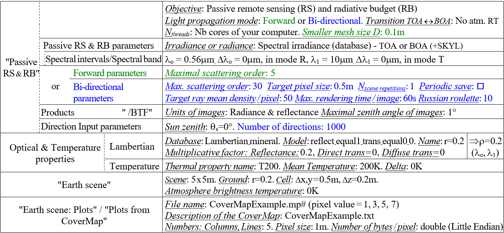
*Only parameters that must be modified are indicated.*
</img>

!!!warning
    DART-Lux does not import yet ground plots

### 1) Cover map importation: WP5A (CT=10")

<u>*Objective:*</u> to import a CoverMap (i.e., land cover / fluid raster image) with the CoverMapImportation tool.

**Create the plots:** 2 options are possible:

<u>*Tool "CoverMapImportation"*</u> (see the image c. below) it creates 1 plot from adjacent pixels in a row of a raster image CoverMap (here: CoverMapExample; value $P_i$ = 1, 3, 5, 7) with same $P_i$ and type $i$ (here: 0: ground, 1: vegetation, 2: ground + vegetation; properties: LAI, $\rho_{ground}$,…) stored in an information text file (here: `CoverMapExample.txt`, [Table](../../Format_DART_files/4-DART_LUX/dart_lux.md#1-scenecfg-and-scenescn)). It stores the created plots into the file plots.xml or the file input/plots.txt, and creates the optical and temperature properties indicated in the information file. It is run before the Maket module with the menu "Run/Properties:  ), the menu "Run/  ) or the Editor ().

<u>*Importation of plots from a `plots.txt`file.*</u> The GUI does not display the plots, which makes it faster if there are many plots. The indices of the optical and temperature properties in the plots.txt must be consistent.

**Run DART for 2 sun directions:** $(\theta_s=0°, \phi_s=0°)$ and $(\theta_s=30°, \phi_s=225°$) (see below)

!!!question
    Environmental effects between plots are much larger for $\theta_s=30°$ than for $\theta_s=0°$. Why?

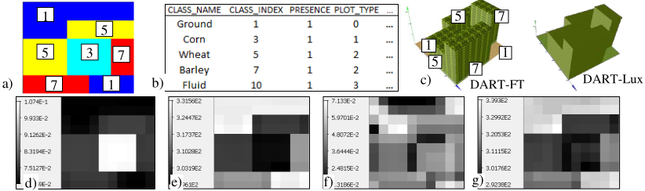
*CoverMap. a) `CoverMapExample.mp#`. b) Part of `CoverMapExample.txt`. c) DART-FT and DART-Lux mock-ups. $\rho_{0.56\mu m}$ and $T_{10\mu m}$ DART-FT nadir images: d,e) $\theta_s = 0°$; f,g) $\theta_s = 30°, \phi_s = 225°$.*
</img>

### 2) Cover map combined with raster DEM

<u>*Objective:*</u> to illustrate how the 3 DART modes ("repetitive", "isolated", "infinite slope") of scene creation with a Digital Elevation Model (DEM) influence the simulation of remote sensing images (see below):

#### 2.a WP5Ba_FT (CT=16" -26")

<u>*Scene*</u>: 4.9 x 5.4km (Bassies, Fr). $T_g=273K$, $\Delta T=10K$. $\rho_{g,0.56\mu m}=0.25$, $\rho_{g,10\mu m}=0.09$. $\theta s=30°$, $\phi s=0°$. TOA $\rightarrow$ BOA: Analytic. DEM (Figure 216.a): `DART/database/Bassies/DEM_Bassies_50.mp#`: 98 lines, 108 col, $\Delta x,y=50m$, double little endian. DART-FT: $\Delta x,y,z: 50m$. $\Delta_{illu}: 5m. $Area\ subdivision_{thermal\ emission}: 10m^2$. DART-Lux: $\Delta r=50m$.

Figure below shows results for the 3 scene creation modes ("Repetitive", "Infinite" and "Isolated" scenes):

1) Computer time (CT), and $\bar{\rho}_{scene}^{nadir}$  and $\bar{\rho}_{\blacksquare}^{nadir}$  of a sub-zone $\blacksquare$ (28, 47) - (31,50), stored as a "mask", at 0.56µm.

2) The three 3D scenes and their DART-FT nadir images at 0.56µm and 10µm.

3) Per scene mode: xz section (y=0), and nadir and oblique $(\theta_v=75°, \phi_v=315°)$ images $\rho_{0.56\mu m}$ and $T_{B,0.56\mu m}$. $\rho$  and $T_B$  depend on the scene mode, especially for oblique directions v since the viewed scene depends on the mode.

4) $\overline{\rho}(\theta_v,\phi_v)$ and $\overline{T}_B(\theta_v, \phi_v)$ at $0.56\mu m$ and $10\mu m$.

!!!question
    DART-Lux: CT decreases if only the nadir image is simulated. Then, there is no BRF map $\bar{\rho}(\theta_v,\phi_v)$ and $\bar{T}_B(\theta_v,\phi_v)$….

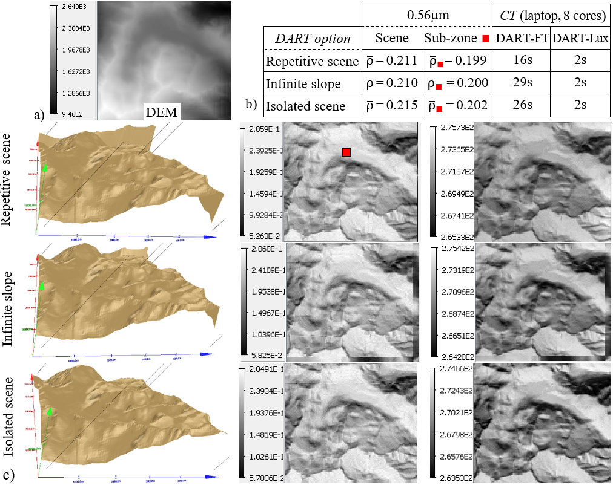</img>

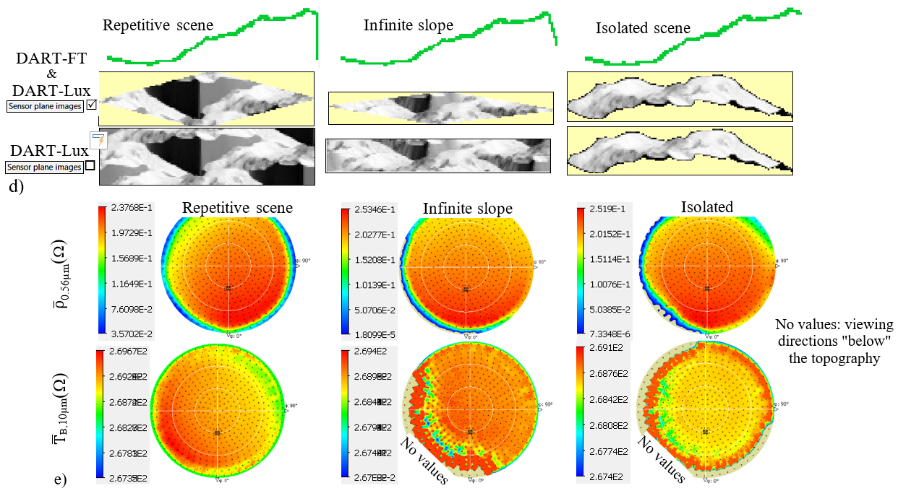
*DART 3 scene creation modes: 'Repetitive', 'Infinite slope', and 'Isolated'. a) DEM. b) CT, $\overline{\rho}$ and $\rho$ (sub-zone : (28, 47) - (31,50)) at $0.56\mu m$, using image tool Stats. c) 3D scene view (intrinsic rotation: 280.8°, nutation: 30°, precession: -30°), and DART-FT nadir images $(0.56\mu m, 10\mu m)$. d) Scene xz section (y=0), DART-FT / Lux images $(0.56\mu m, 10\mu m; \theta_v=75°, \phi_v=315°)$. e) $\overline{\rho}(\theta_v,\phi_v)$, $\overline{T}_B(\theta_v,\phi_v)$; $\phi_{origin} =$ North-South.*
</img>

#### 2.b - Scene with DEM and CoverMap Bassies_NoSnow50.mp#: WP5Bb_Lux and WP5Bb-FT (CT=24")

Import CoverMap `Bassies_NoSnow50.mp#`: float little endian, description file `Bassies_CoverMap_Descriptor.txt` (bare rock: 2, vegetation: 3, 273K).
!!!question
    $\overline{\rho}_{0.56\mu m}(\Omega)$ and $\overline{T}_{B,10\mu m}(\Omega)$ depend on the scene creation mode (see below). Why?

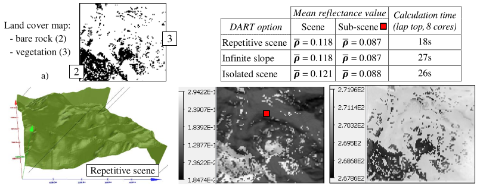</img>

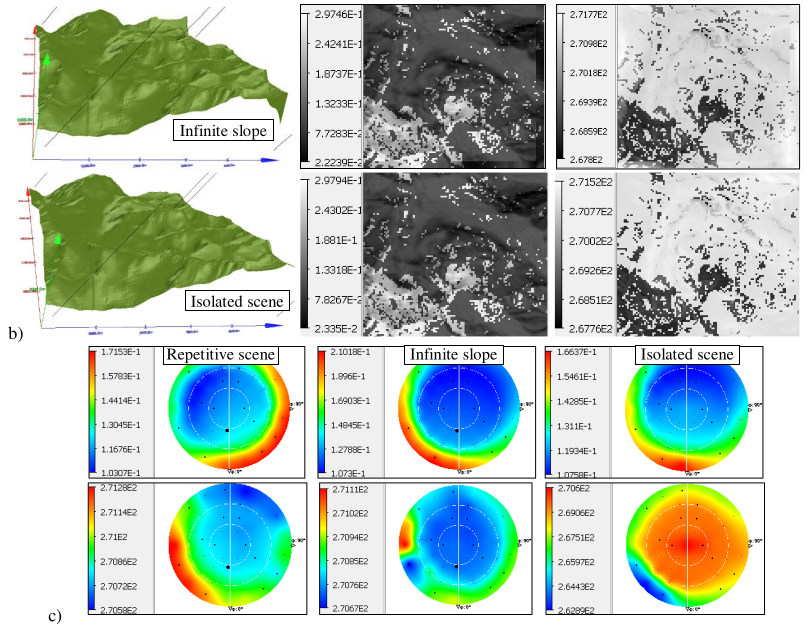
*The 3 scene creation modes. a) Bassies CoverMap. b,c) Same legend as the previous image .*
</img>

### 3) Transmittance, reflectance and brightness temperature of a 1m thick air layer: WP5C

<u>*Objective:*</u> $0.56\mu m$ and $10\mu m$ nadir direct transmittance $t_{dir}$, diffuse transmittance $t_{diff}$, reflectance $\rho_{scene}$ and brightness temperature $T_{B,scene}$ of a 1m thick layer of Rayleigh gas (molecule: cross section $\sigma_{R,0.56\mu m}=4.20128 \times10^{-31} m^2$, $\sigma_{R,10\mu m}=3.11543\times 10^{-36} m^2$, single scattering albedo $\omega_R =1$, phase function $\frac {P_r} {4\pi}$, density $N_{mol}$, temperature $T_{mol}$). Here: $\theta_{sun}=0°$.

<u>*Approach:*</u> a DART plot filled with air over a lambertian surface ($\rho_{g,0.56\mu m}=1$, $\rho_{g,10\mu m}=0, T_g=300K$) simulates a gas layer of depth $\Delta h_{plot}$. Then: $t_{dir,\lambda} = e^{-\Delta \tau_{\lambda}}$ with layer optical depth $\Delta \tau_{\lambda} = N_{mol}.\sigma_{\lambda}.\Delta h_{plot}$.

<u>*Scene:*</u> 1x1m. No atmosphere RT ($E_{BOA,\lambda} = E_{TOA,\lambda}$, SKYL=0). $\theta_s=0°$. Plot 1x1m. $h_{bottom}=1m$, $\Delta h=1m$) filled with "Rayleigh air". $N_{mol}=5.9505674461 \times 10^{29} m^{-3}$. DART-FT: $\Delta x=1m, \Delta z=1m$. DART-Lux: $\Delta r=1m.$

**Direct transmittance** $t_{dir,\lambda}$: WP5Ca

$t_{dir,\lambda}$ is derived from order 1 reflectance $\rho_{plot,\lambda}^1 = (t_{1,\lambda})^2$ and $t_{1,\lambda} =\%E_{ground}^{IlluDir}$ for $\lambda = 0.56\mu m$ and $10\mu m$; for that, we set $\omega_R = 0$ (i.e., null multiplicative factor) so that order 1 upward radiation from the air layer comes only from the ground.

!!!question
    Verify: $\Delta \tau_{0.56\mu m} = 0.25$, $\Delta \tau_{10\mu m} = 1.85\times 10^{-6}$, $\rho_{plot,0.56\mu m} = 0.6065$ ($\implies t_{1,0.56\mu m} = 0.779$), $\%E_{ground,0.56\mu m}^{IlluDir} = 0.779$, $\rho_{plot,10\mu m} = 6.86\times 10^{-7} .6065$ ($\implies t_{1,10\mu m} = 0.9999982$), $\%E_{ground,10\mu m}^{IlluDir} = 0.999998$.

### 4) Order 1 reflectance of a scattering air layer (copy of WP5C): WP5D (CT=1")

<u>*Objective:*</u> to compare order 1 reflectance (see below) of a gas layer (optical depth $\Delta \tau_{air}$, Rayleigh molecules: $\omega =1$) of a DART plot filled with air ($\rho_{1,plot}$: WPDa), a DART atmosphere layer ($\rho_{1,atm}$: WPDb) and an equation ($\rho_{1,eq}$: `WP5.xls`).

<u>*Scene:*</u> 20m x 20m. $\rho_{ground} = 0.56\mu m$. $\theta_{sun}=0°$, SKYL=0. $\lambda = 0.56\mu m$. Forward mode: $\Delta x=\Delta y=20m, \Delta z=0.05m$.

- **WP5Da**: plot. $\Delta h_{plot}=1m.$ 'rayleigh_air'. $N_{mol}: 5.9510^{28} m^{-3}$, $5.9510^{29} m^{-3}$, $5.9510^{30} m^{-3}$ $\implies$ $\tau_m= \Delta h.N.\sigma$ : 0.025, 0.25, 2.5.
- **WP5Db**: atmosphere $\rho_{1,atm,DART}$ with 3 optical depths of WP5Da; option 'Atmosphere with user defined parameters'.
- **Equation** (WP5.xls): $\rho_{1,eq}(\tau_m, \Omega_s \rightarrow \Omega_v)=\frac {\omega.P_m(\Omega_s \rightarrow \Omega_v)} {4.(\mu_v - \mu_s)}.(1 - e^{\frac {\tau_m} {\mu_s} - \frac {\tau_m} {\mu_v}})$, where $P_m=a.(1 + cos^2(\psi_{sv})) + c$, $a=0.719, c=0.04127, \omega=1$

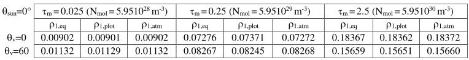
*Order 1 reflectance: analytical, fluid plot and atmosphere for 3 air optical depths (0.025, 0.25, 2.5).*
</img>

Discrete scattering functions $\int_{\Delta \Omega_{out}} \frac {P(\Omega_{in} ,\Omega)} {4\pi}.d\Omega$ of volumes (i.e., turbid medium, fluid) are stored as binary files in folder "output/ lib_phase". Option `View / Scattering functions` (see the image a. below) exports them as txt files. Option "Directions 3D View + Choose $X(\theta,\phi)$" displays them (see the image b. below): for {$\Omega_{in}= \Omega_s$ , $\Omega_{out} = any direction \Omega_n$ ; here: $\Delta \Omega_n \approx 0.12628$ except $\Delta \Omega_0 \approx 0.09546$} and {$\Omega_{in}=$ angular sector $\Omega_{sector}, \Omega_{out} = \Omega_ n$).

!!!question
    Verify that $\int_{\Delta \Omega_{out}} \frac {P(\Omega_{in} ,\Omega)} {4\pi}.d\Omega \approx \frac {P(\Omega_{in} ,\Omega_{out})} {4\pi}.\Delta \Omega_{out}$ and $\frac {P(\Omega_{sector}, \Omega_n)} {4\pi}$ is azimuthally symmetric (i.e., same value for all directions with same $\Psi_{sector,n}$) and symmetric relative to the plane that is perpendicular to the incident direction.

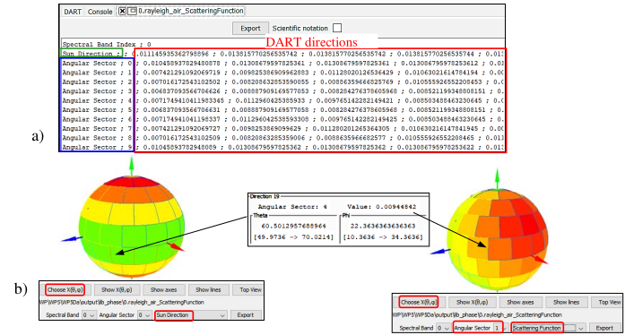
*Discrete Rayleigh scattering function $\int_{\Delta \Omega_{out}} \frac {P(\Omega_{in} ,\Omega)} {4\pi}.d\Omega$ (binary file 0.rayleigh_air_ScatteringFunction. a) Option 'View / Scattering functions': scattering from sun direction + 10 sectors (0 - 9) $\rightarrow$ all DART directions. b) Option 'View / Directions 3D View' + overlay $\frac {P(\theta, \phi)} {4\pi}.\Delta \Omega$ on the sphere. Incident: sun (left), sector 1 (right).*
</img>

### 5) Bi-directional reflectance of a snow layer: WP5Ea and WP5Eb

<u>*Objective:*</u> to apply in WP5Eb an analytic "snow layer bi-directional reflectance factor (BRF)" computed in WP5Ea.

<u>*Scene:*</u> 1x1m, $\Delta z=0.1m$, {$0.55\mu m$, $1\mu m; \Delta \lambda=0\mu m$}. Fluid plot: 1x1x1m, snow (fluid.db: $\sigma_{snow}=7.854 \times10^{-7}m^2$, $\omega_{0.5\mu m} \approx 0.999991$, $\omega_{1\mu m} \approx 0.99646$), $10^9$ particles/$m^3$. $Max(N_{iterations}): 10^2$. Threshold: 0 to stop rays/iterations. $\theta_s =50°$, $\phi_s =225°$. Upward region ( $\Delta \Omega =6.29sr$ ): 400 directions (see below). An Henyey Greenstein function simulates snow scattering phase function (asymetric factor: 0.85582 at $0.55\mu m$, 0.85999 at $1\mu m$).

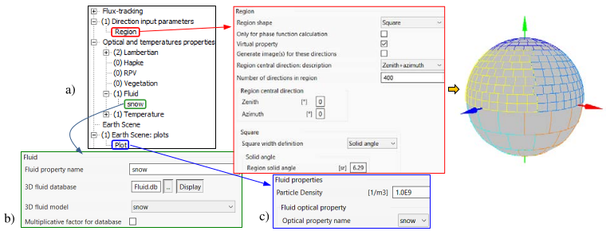
*a) 400 directions ($\Delta \Omega_{upward \:region}=6.29sr)$. b) "snow" optical property. c) Fluid plot property.*
</img>

!!!question
    Check in `dart.txt` file that scene albedo is 0.999895 at $0.55\mu m$ and 0.959668 at $1\mu m$.

To decrease computer time and memory, large scenes can be simulated as ground surfaces whose reflectance is an analytic BRF model derived from the fit of the BRF of part of the scene. The tool "Computation of parametric model coefficients" does this fit for a few analytic models. The following image b. shows the snow BRF fitted with the Hapke and RPV models, with directions $\theta_v < 60°$. WP5Eb illustrates that the BRF of the resulting scene is that of the fitted model.

*BRF of a 1m deep snow layer. $\lambda=0.55\mu m$. $\theta_s =50°, \phi_s =225°.$ DART (x) and sun (•) directions. Initial BRF: a) $\theta_v<60°$; b) $\theta_v<60°$. c) Hapke coefficients (coefficients Hapke files in Bandx folders). d) Hapke (top) and MRVP (bottom) fitted $(\theta_v<60°)$ BRF and "Initial - Fitted" BRF.*
</img>

### 6) Reflectance of a water volume: WP5F

<u>*Objective:*</u> to illustrate how to simulate a water volume, including refraction and specular reflectance. The option "Hidden" that hides scene elements allows one to quantify the impact of each element on scene reflectance.

<u>*Scene:*</u> 8x12m. Fluid plot: 8x8x1m. `Fill Mode`: maximum filling altitude=1m, Particle density=$5 \times10^{16} m^{-3}$. $\lambda=0.75\mu m$. $\theta_s =30°, \phi_s =270°.$ 2 viewing directions: ($\theta_v =0°, \phi_v =0°$), $(\theta_v =30°, \phi_v =90°)$.

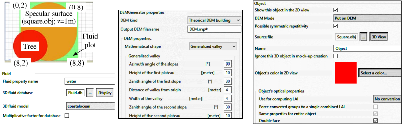</img>

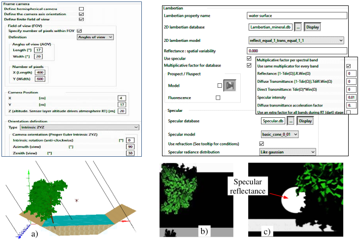
*Water and tree: mock-up (a) and DART images: satellite nadir (b) and oblique camera (c).*
</img>

