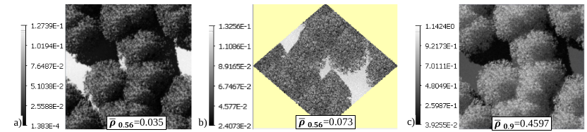

<u>*Objective:*</u> spatial distribution of DART-created and imported trees, possibly using fields (i.e., xy location,… per tree).

*a) Parameters to set: Forward (DART-FT) and Bi-directional (DART-Lux) modes. b) File `trees_WP6.txt` in simulation input folder. It can be the edition of file trees.txt in DART database.*
</img>

### 1) Tree creation: WP6A

<u>*Objective:*</u> the 3 DART methods (, , ) to get DART-created trees.

</img>

#### 1.a - Turbid tree + option "Exact location + Random dimensions": WP6Aa_FT

Tree creation method  only reads the tree species index (i.e., optical properties, LAI profile,…), xy location, and possibly leaf area (noted LAI!), from a tree file (here: `trees_WP6.txt`) that can store each tree geometry. Other information is directly specified by the user in the GUI. The figure below shows scene nadir images.

*Nadir images. a) $0.4\mu m$. b) $0.56\mu m$. c) $0.66\mu m$. d) $0.9\mu m$. e) Color composite (cf. [III.7.9](../../DART_functionalities_and_products/7-Tools_menu/7.9/color_composite.md), [WP3E](../T3/t3.md#4-toa-sensor-and-boa-spectra-wp3e-ft-ct37s-wp3e-lux-ct53s)).*
</img>

**Create the scene** $NDVI=\frac {\rho_{NIR} - \rho_{red}} {\rho_{NIR} + \rho_{red}}$ image (see below): tool `Tools/Band Combination` (cf. [WP3H](../T3/t3.md#7s-specular-reflectance-and-polarization-wp3h-ct24))

!!!question
    Check the consistency of NDVI image: high value for green vegetation and low for bare ground.

*Scene NDVI image.*
</img>

!!! note
    In the Forward mode, the information panel of menu "View\ Scene 2D") displays $LAI_{scene}$; here, it is $\frac {leaf\:area} {scene\:area} = 3$.

!!! note
    For below copies of WP6Aa, the folder "BandCombination" can be deleted to reduce computer memory.

#### 1.b - Turbid tree + "Exact location + Exact dimensions": WP6Ab_FT (copy of WP6Aa)

- Set DART tree creation method  with WP6Aa's hole distribution. Then, DART uses all available data of file `trees_WP6.txt` (crown shape,…). Note that the tree geometry slightly differs from WP6Aa.

#### 1.c - Triangle tree + "Exact location + Exact dimensions": WP6Ac_FT (copy of WP6Ab)

- "Fill" the tree crown with triangles ($area_{triangle}$: 0.03$m^2$) instead of turbid medium.
- Set the Maket product "Triangles area products" (i.e., distribution of areatriangle as 3D array, vertical profile, and per type of scene element. Here, we only select "per type"; results (i.e., $300m^2$ for leaves and $100m^2$ for the scene) are stored in the "Maket" section of `SimulationProperties.txt` file.

- Set Maket product  to create the 3D object `dsm.obj`. It stores all facets of the scene into 3 groups: "DARTground","DARTcanopy" and "DARTtrunk". Comment its 2 ground facets "f 1 2 3" et "f 4 5 6" to get the 3D tree object, and name it `TreeObjWP6Ac.obj`; WP6B_Lux uses it.

### 2) Tree creation + option "Random location + Random dimensions": WP6B (copy of WP6Aa)

<u>*Scene:*</u> 20m x 20m. Tree creation method  randomly locates (see below) the WP6Aa tree at nodes of a grid $(\Delta x=4m, \Delta y=5m)$ inside disks (radius 2m) with 90% probability of presence. Crowns are filled with $0.03m^2$ facets. LAI=3.

The figure below illustrates that images of a same scene from successive DART runs differ if the scene is simulated with
option  because this option leads to different tree and leaf / hole geometries.

#### 2.a - DART-FT (WP6B_FT)
computer time (CT) is 2' 39" with $\Delta r = 0.5m$ and 32' 14" with $\Delta r = 0.1m$.

*Menu of method  "Random location + Random dimensions" for creating a tree spatial distribution.*
</img>

*DART-FT simulated with images option . $0.56\mu m$.*
</img>

#### 2.b - DART-Lux (WP6b-Lux)

With option "Conversion of N turbid tree crowns into facets in the tree crown volume", DART-Lux creates N 3D independent objects ($\implies$ N ply files). Another approach is shown here.

- Edit the file Tree_report (i.e., location xy, $N_{triangles}$ & $Area_{triangle}$ / tree) of WP6B_FT as the field `FieldObjWP6B.txt` to get the tree xy distribution of WP6B_FT. Specific scaling factors $(s_x,s_y,s_z)$ and rotations $(rot_1,rot_2, rot_3)$ could be applied per tree to get variable trees, which is more realistic. Note that a factor $s=s_x=s_y=s_z$ multiplies the foliar area by $s^2$.

- Import the field of 3D objects `FieldObjWP6B.txt` (see below) and object `TreeObjWP6Ac.obj`. All trees will be clones of this object ($\implies$ 1 ply file). Set the correct surface optical properties to the groups DARTcanopy and DARTtrunk.

*Importation of the 3D object TreeObjWP6Ac.objin the field `FieldObjWP6B.txt`.*
</img>

</img>

The figure above shows:

* Images (WP6B_Lux): $0.56\mu m$ (a: nadir, b: oblique) and $0.9\mu m$ (c: nadir), pixel size $\Delta r = 0.1m$, CT=2' 26".
* 2D BRF plot:
    - direct interpolation of the 360 x 90 BRF map. $N_{samples}$: 50 (d: WP6B_Lux) & 103 (e: WP6B_Lux_BRF). ($0.56\mu m$) 
    - interpolation of `brf.txt` that stores mean values of DART images and interpolations of the BRF map for all upward discrete directions (here: 103 + plus directions around hot spot). It is usually smoother than the direct 2D BRF plot. $N_{samples} = 50$ (f: WP6B_Lux) and 103 (g: WP6B_Lux_BRF).
* 1D BRF plot (solar plane, 4 bands): interpolation of `brf.txt`. $N_{samples} = 50$ (h: WP6B_Lux) & 103 (i: WP6B_Lux_BRF).

!!!question
    BRF plots become smoother with increasing $N_{samples}$.

!!!question
    Due to its 1° resolution, the BRF map, and therefore the direct 2D BRF, tends to underestimate the hotspot (by more than 13% at $0.56\mu m$ with $N_{samples}=103$).. `brf.txt`, and therefore its associated 2D BRF plot, is more accurate around the hotspot, if the hotspot image is simulated and if thehotspot direction from the BRF map is removed).

!!!question
    With small $N_{samples}=50$, the random noise can lead to maximal reflectance in the neighborhood of the hotspot.

!!!question
    BRF is minimal for very oblique directions. This effect decreases if $N_{scene repetition}$ is increased.

</img>

*DART-Lux. $\Delta r=0.1m$. $\theta_s=30°, \phi_s=225°$. Images: $0.56\mu m$ (a: nadir, b: oblique), $0.9\mu m$ (c: nadir); CT=2' 26". 2D BRF ($0.56\mu m$ ): d,e) direct interpolation of BRF map; f,g) interpolation of `brf.txt` (from BRF map + hotspot image; manual removal of BRF map's hotspot direction). h,i) 1D BRF (4 bands, solar plane): interpolation of `brf.txt`.*
</img>

### 3) Creation of a scene with different tree species: WP6C (copy of WP6Aa_FT)

<u>*Objective:*</u> scene with several tree species (i.e., crown shape,..) + Option "Exact location + Random dimensions".

<u>*Scene:*</u> 20m x 20m. 4 DART-created trees (2 tree species: 0, 1). The table below shows the tree file  (species, x, y, and possibly Leaf area), the DART-tree GUI menu , and tree parameters  per species.

The images below show the scene mock-up and nadir images from DART-FT at $\Delta r=0.5m$ and DART-Lux at $\Delta r=0.1m$.

</img>
*Setting DART-created trees.  Tree position file.  DART-created trees menu.  Tree species parameters.*

*a) 3D scene mock-up. Nadir images: b) DART-FT, $\Delta r=0.5m$; c) DART-Lux: $\Delta r=0.1m$. $0.56\mu m$.*
</img>

### 4) Importation of 3D tree: WP6D (copy of WP6Aa_FT)

<u>*Objective:*</u> to import a 3D tree (i.e., 3D object made of facets) (WP6Da) and a field of 3D trees (WP6Db).

<u>*Scene:*</u> 10m x 10m. 4 bands {$0.4\mu m$, $0.56\mu m$, $0.66\mu m$, $0.9\mu m$}.

!!!note
    For DART-FT: the illumination grid must be consistent with facet dimensions for getting accurate results.
- DART-created trees can be ignored () or removed (). Here, we remove them (). </img>

#### 4.a - WP6Da

**Import and display the 3D tree `benjamina.obj`, and rename its groups** (the images a. and b. below)

The tree is located in folder `Dart\database\3D_Objects\Tree\Aesthetic_Trees\Deciduous`. It is made of 25800 triangles that belong to 2 groups: 1 group for trunk and branches and 1 group for leaves. Specific properties are assigned per group. To view each group individually, display the tree with the '3D View' option (see the images b. and c. below), then, select a group (see the images a. and d. below). Groups can be named "Trunk" and "Leaf".

**Define colors and assign them to the groups:** menu "Colors / Custom colors" (see the image a. below)

The color of a facet sets its material. The file `input\dart.typ` lists all defined materials, including DART materials.

**Set the tree location (x=y=4) and scale factor** (1.8 for all axes): menu `Object / Geometric properties`

**Assign optical properties per group of facets:** menu `Object / Groups / Group` (see the image e. below)

The "double face" option is needed for the group "Leaf" to get scattering on the 2 faces of leaf facets. It is not needed for the group "Trunk" because the trunk facets have normals that are oriented towards trunk outside.

**Run DART and create the color composite image with the RGB nadir images** (see the image f. below)

*a,b) Importation of a 3D tree. c,d) The tree mock-up. e) Properties of the trunk. f) Color composite.*
</img>

#### 4.b - WP6Db (copy of WP6Da)

**Remove the 3D tree.** Then, there is no individually imported 3D object (see  the  of the image below)

**Import a Field of objects  and 2 3D models** "Citrus CISY1"  and "CISY4"  

The image below shows the 3D mock-up of the scene and a color composite of DART nadir images.

*Field of 2 types of trees. a) Menu. b) Field file. c) Mock-up. d) DART-Lux nadir image. $\Delta r=2cm$.*
</img>

### 5) Transformation of an imported 3D triangle tree into a turbid tree: WP6E (copy of WP6Da)

3D trees made of many facets (e.g., $10^6$ per tree) can need huge CT and RAM. DART-Lux greatly reduces them by simulating trees as clones of several 3D trees, with xyz scalings and rotations per tree. There is another solution presented here with DART-FT: facets are transformed into turbid medium volumes. Note that CT can be much larger for turbid trees than for facet trees if $N_{turbid \:volumes}$ is huge conversely to $N_{facets}$. For DART-FT, CT and accuracy for "turbid" trees usually decrease with coarser spatial resolution, and they mostly depend on $N_{facets}$ for facet trees.

**WP6E_FT:** the 'Triangle $\rightarrow$ Turbid' transformation can be done at any spatial resolution (see below) with pre-defined turbid optical properties, and user specified or automatically derived LAD and LAI.

*Transformation "Triangle $\rightarrow$ Turbid". 4 spatial resolutions: a) 0.5m, b), 0.25m, c) 0.1m, d) 0.05m.*
</img>

The figure above shows nadir reflectance images, $\overline{\rho}$ and CT at $0.56\mu m$ ($\Delta r=0.1m, 0.2m, 0.3m$). With $\Delta r$ decrease, we note:

- Turbid tree: CT greatly increases and $\overline{\rho}$ accuracy improves mostly due to better shadow simulation. $\overline{\rho}$ does not change much if LAD is computed or pre-computed.
- Facet tree: CT remains much smaller than for the turbid tree, and $\overline{\rho}$ remains nearly constant.

*DART-FT scene reflectance $\overline{\rho}$ and computation time $\Delta t$. Facet and turbid trees. 3 cell sizes: $\Delta r=0.1m$, 0.25mand 0.5m. Transformation "Facet $\rightarrow$ Turbid" is with pre-defined and computed LAD. $0.56\mu m$.*
</img>

!!!note
    The conversion "Facets $\rightarrow$ Turbid" in DART-Lux gives similar results. However, it is not always advised because it can lead to a scene with many turbid volumes, especially if Nscene repetition is large, which in turn leads to many PLY files and very large file `scene.scn`, which can be unnecessarily too computer demanding.

**WP6E_Lux:** compared to DART-FT, it is usually greatly faster, with much less RAM and radiative transfer modeling parameters (i.e., $N_{scat}, N_{scene\: repetitions}, N_{samples}$, and Russian Roulette (RR) scattering depth $N_{RR,depth}$ and surviving probability PRR). Depending on 3D scenes, DART default parameters may not be optimal for the best trade-off "Accuracy of $\rho_{scene}$ - CT". This is illustrated here with the 10m x 10m Benjamina scene, especially at $0.9\mu m$ because convergence is slower for this band due to greater multiple scattering. DART-Lux images (see below) simulated with {$N_{scat}=300, N_{scene \:repetitions}=10$, $N_{samples}=300$} ($CT_{ref}=207s$) are used as references to assess how $N_{scat}, N_{samples}$ and RR impact CT and relative error $\epsilon_{\rho}$ of $\overline{\rho}$.

- $0.56\mu m$: $\epsilon_{\rho} < 2 \times10^{-2}\:\: \forall N_{scat} \ge 10, N_{sample} \ge 10$. CTs greatly vary: 7" if $N_{scat} = N_{sample} = 10; 154$" if $N_{scat} = N_{sample} = 10^2$.
- $0.9\mu m$: $N_{scat} \ge 30 \implies \epsilon_{\rho} < 10^{-2} \:\: \forall N_{sample}$. CT =14s and $\epsilon_{\rho} = -7\times 10^{-3}$ for {$N_{scat} = 30, N_{sample} = 10$}. RR decreases CT, especially for small $N_{depth}$, but increases the image variance. For {$N_{scat}=100$, $N_{sample}=50$], CT=18" if $N_{depth}=10$,CT=24" if $N_{depth}=20$, and CT=27" if $N_{depth}=30$, whereas CT=34" without RR. CT tends to be proportional to $N_{sample}$, and slowly increases with increase of $N_{scat}$. The optimal parameters depend on the expected accuracy on $\rho_{scene}$ and Monte Carlo noise in images. Here, {$N_{scat}=10^2$, $N_{sample}=50$, $N_{depth}=30$} can be a good choice.

*DART-Lux nadir reflectance images. They are used as reference images. CT = 208".*
</img>

*DART-Lux $\overline{\rho}(N_{samples})$ for $N_{scat} = 10$ to $10^2$. a)$\overline{\rho}_{0.56 \mu m}$. b) $\overline{\rho}_{0.9 \mu m}$. c)$\epsilon_{\overline{\rho}_{0.9 \mu m}}$. d) $CT_{0.9 \mu m}$. No Russian Roulette*
</img>

*DART-Lux images. No RR: $N_{scat}=10$ , $N_{samples} = 10$ (a), 50 (b), 102 (c). RR: $N_{samples} = 10$ (d), 50 (e). $\Delta r=0.05m$.*
</img>

### 6) Comparison of DART methods for simulating vegetation: WP6F

DART-FT: vegetation is simulated with facets (triangles) or voxels filled with turbid medium (i.e., turbid voxels) that represent leaves and twigs. Conversely to turbid voxels, facets are independent of DART voxels, which simplifies multi-scale studies. Hence, for vegetation-facet, computation time (CT) depends mostly on the number of facets ($N_{facets}$). For vegetation simulated with turbid voxels, CT depends mostly on the number of turbid voxels ($N_{turbid\:voxels}$). A usual initial step is to determine the optimal vegetation simulation mode. It is a trade-off between "accuracy" and "CT and computer memory". It mostly depends on $N_{facets}$ and $N_{turbid\: voxels}$.

DART-Lux: no use of voxels, and great CT / RAM decrease, especially if fields of 3D objects are used.

<u>*Scene:*</u> 4 bands ($0.4\mu m, 0.56\mu m, 0.68\mu m, 0.9\mu m$). 40mx40m horizontal ground. $\Delta x=\Delta y=\Delta z=1m$. Tree at (20m, 20m). LAI = 2.14. $\rho_{leaf} = \rho_{grass\:rye}$. Four tree simulation methods are considered.

CT and scene reflectance $\rho_{scene}$ depend on the tree simulation mode (see below):

1. Facet-tree (imported): cherry tree with scale factor 30. It has 2 groups: 'leaf' (15966 facets) and 'wood' (3628 facets). It is the best trade-off for "CT vs. accuracy", because $N_{facets}$ is small.
2. Derived turbid-tree: group 'leaf' of facet-tree 'a' is transformed into 'turbid', keeping more or less its geometry.
3. DART-created ellipsoidal turbid tree with dimensions of tree 'a' without trunk ($\Phi_{trunk}=0m$): $H_{trunk\: below\: crown}=1m$, $H_{crown}=33m$, $\Phi_{crown}=0m$. The trunk and branches are those of 3D tree 'a'.
4. DART-created ellipsoidal turbid tree 'c' with crown randomly filled with $0.03m^2 / 0.3m^2 / 3m^2$ facets. If facets are very small ($\implies$ very large $N_{facets}$), tree 'd' is equivalent to tree 'c' (i.e., $\rho_{scene}(tree\; d) \approx \rho_{scene}(tree\; c)$), but CT can become huge. The ideal $N_{facets}$ is a trade-off between accuracy and CT. Here, with $3m^2$ leaves, CT decreases by a factor 20, while keeping the ρscene relative difference $\approx 0.01$.

!!!note
    - trees 'c' and 'd' cannot exactly mimic facet tree 'a'. For example, here, their dimensions are the extreme dimensions of the facet tree 'a', which is not optimal.
    - facet tree 'd' can be more realistic than turbid tree 'c', although turbid tree 'c' is often considered as a reference.

*Four tree simulation methods. DART-FT. a) Cherry tree. b) Turbid tree derived from tree 'a'. c) Tree with dimensions of 'a' filled with turbid medium and with $0.03m^2$ (d), $0.3m^2$ (e) and $3m^2$ (f) facets.*
</img>

