<u>*Objective:*</u> to study environmental / topographic effects in a satellite image.

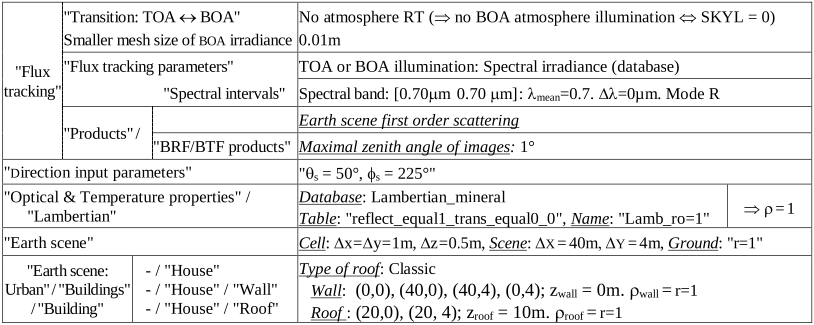
*Parameters that must be modified are indicated. The house roof is used to simulate topography.*
</img>

### 1) Reflectance of a slope with a given sun illumination direction: WP7A

<u>*Objective:*</u> to study how slope reflectance varies with the illumination direction (scene = 2 slopes of a roof).

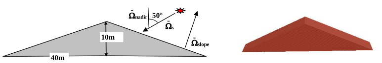
*Parameters that must be modified are indicated. The house roof is used to simulate topography.*
</img>

**Display DART nadir images at 1st order and iteration X** (see below).

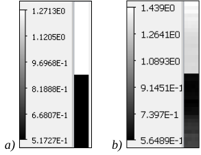
*DART simulation of the slopes. a) Order 1. b) Order X.*
</img>

- the observed mean 1st order reflectance $\rho_{1,obs,roof}$ of roof slopes are 0.517 and 1.27, respectively, whereas the reflectance of roof material is $\rho_{roof}=1$. Why? Note: $\rho_{1,obs,roof} = \frac {\bar{\Omega}_s.\bar{\Omega}_{roof}} {\bar{\Omega}_s.\bar{\Omega}_{nadir}}$.
- Why does the reflectance of each roof slope decreases with altitude in image IterX?

!!!note
    Option </img> decreases a lot computer time. It computes 1st order reflectance only.

### 2) Reflectance as a function of solar time: WP7B

<u>*Objective:*</u> $\rho_{slope}$(solar time), without and with atmosphere R.T.

<u>*Scene*</u> (Toulouse) coordinates (menu "Earth scene":see below): Long. = 1.45°, Lat. = 43.617°, altitude = 200m.
- Solar time (menu "Direction input parameters"): June 21, 2019, time = 12h.
- Atmosphere: USTD76 gas model, rural aerosol (Vis=5km). Manual / constant geometry: dZ=500m, HMA=4km,...

<u>*Create the sequence:*</u> 7h, 9h, 11h, 13h, 15h, 17h, 19h

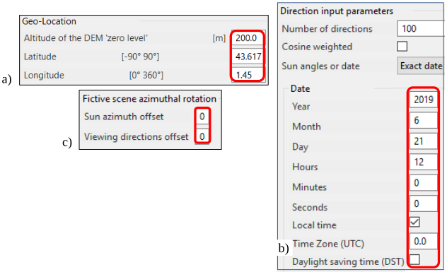
*a) Coordinate of the scene (i.e., Toulouse city). b) Date (solar time). Combined with the scene coordinate, it gives the local sun direction. c) A rotation of the sun direction can mimic a scene rotation. Compared to the scene rotation, the advantage is to work with exactly the same mock-up without any geometric distorsion.*
</img>

**Run the sequence without atmosphere and with atmosphere R.T.**

Results are stored in the LUT, and its data are displayed with the mode "Time". The image below shows nadir reflectance images at 7 solar times for 2 cases: without (SKYL=0) and with atmosphere RT, the angles $(\theta_{sun}, \phi_{sun})$ of the 7 sun directions, and the time variation of reflectance for nadir and oblique viewing (41°, 30°) directions.

!!!question
    Early morning and late afternoon, $\rho_{North\: slope,BOA} > \rho_{South\: slope,BOA}$, conversely to the rest of the day. Why?
!!!question
    At 19h, $\rho_{North\: slope,BOA} \approx 0$, except at the top, if SKYL=0. It is not null if atmosphere R.T. is simulated. Why?
!!!question
    TOA nadir reflectance is always smaller than BOA nadir reflectance. Why?

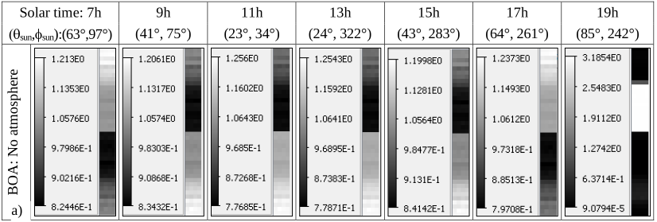</img>

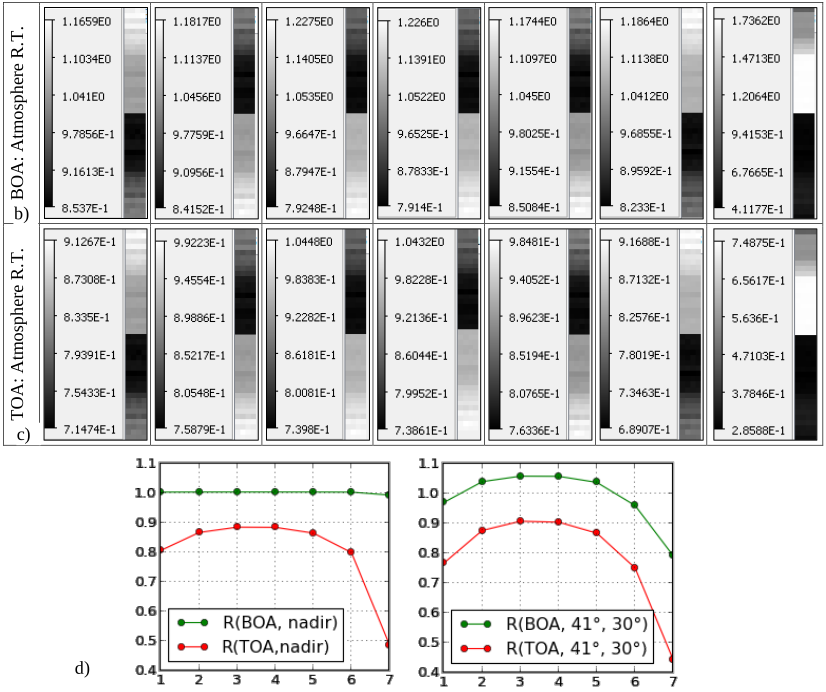
*Nadir images (BOA without (a) and with (b) atmosphere, TOA (c)) and time variation of TOA and BOA reflectance for nadir and oblique viewing directions. DART 5.7.4 V1085.*
</img>

### 3) DEM creation with option "Repetitive scene" and "Infinite slope"

<u>*Objective:*</u> to create a slope with the tool DEMGenerator (cf. III.5.1) and to study its reflectance

<u>*Scene:*</u> $\Delta X=40m, \Delta Y=4m. \Delta x=\Delta y=1m, \Delta z=0.5m$. No atmosphere (SKYL: 0). $\theta_{sun}=50°, \phi_{sun}=225°$. Illumination grid: 5mm.

- Create a slope (i.e., DEM) with option 'Create Topography' in menu 'Earth scene / DEMGenerator':
    - DEM kind: select the option "Theoretical DEM Building"
    - DEM properties: set option "Generalized valley" and parameters of the image below.
    - Create the DEM: run the module "DEMGenerator" with  in the Simulation Editor or directly from the menu "Run". Then, 2 triangles are created per pixel (x,y) of the DEM (cf. dart handbook.pdf).
    - Set the option "Presence of topography". Option "3D view" (see below). displays the 3D DEM.

#### 3.1 Scene creation with option "Repetitive scene": WP7Ca (copy of WP7A)

- Select the option "Repetitive scene" (default option) in the menu "Earth scene" and run the Maket module.

The "View Scene 2D" and "View Scene 2D" menus display the 2D and 3D views (see below) of the scene created by the "Maket" module, respectively. Being infinite with a repetitive pattern, the scene contains a nearly vertical "wall" with an altitude range from the scene left side altitude to the scene right side altitude.

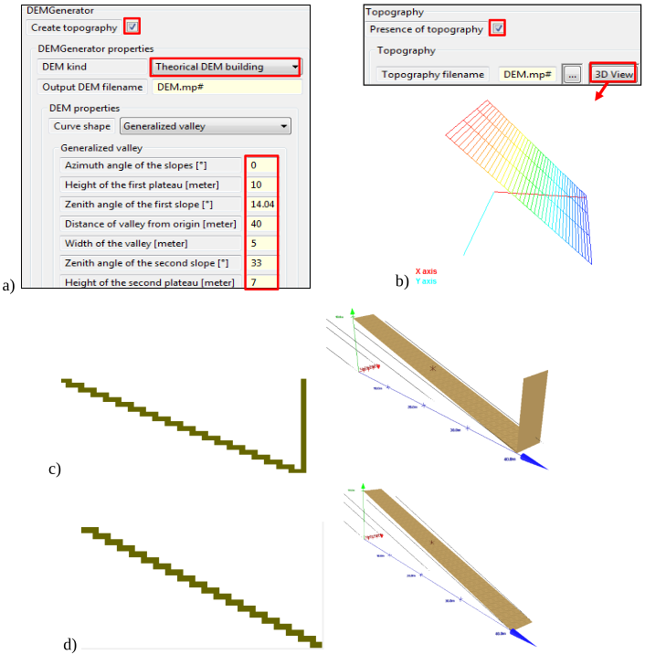
*Slope creation with the tool "DEM_Generator". a) Menu. b) Input and 3D view of the DEM used for creating the mock-up. 2D x-z (menu 'View Scene 2D') and 3D (menu 'View Scene 2D') views of the 3D scene created with the "Repetitive scene" option (c) and with the "Infinite slope" option (d).*
</img>

The figure above shows the $1^{st}$ scattering order and IterX nadir images.

!!!question
    Iter 1 image has 2 values only: 0.766 and 0.94. Why?
!!!question
    In IterX image, slope reflectance increases from lower to higher altitude. Why?

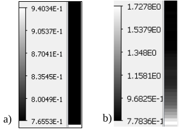
*Nadir images of a slope. Order 1 (a) and iteration X (b).*
</img>

#### 3.2 Scene creation with option "Infinite slope" WP7Cb (copy of WP7Ca)

<u>*Scene:*</u> $\Delta Y=10m$ and "infinite slope" option.

!!!question
    At any iteration, DART images are identical to images at Iter1. The slight spatial variation of slope reflectance $\rho_{slope}^{*}$ (see below) is due to the finite dimensions of the cells $\Delta r_{cell}$, triangles $\Delta r_{triangle}$ (2 triangles per pixel of the raster DEM) and illumination mesh grid $\Delta r_{illumin}$.
     Here, $\rho_{slope}^{*} \in [0.7656;\: 0.7658]$ with $\Delta r_{illumin} = 5mm$.

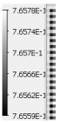
*Nadir image of a slope. Simulation with "infinite slope" option.*
</img>

#### 3.3 Scene creation with a3D object derived from the option "Infinite slope" WP7Cc (copy of WP7Cb)

A DART flat ground is made of 2 triangles. Hence, the "triangle" ground radiative budget (RB) is represented by 2 triangles only, and there is a unique ground scattering event per cell of the current simulation. Very often, one expects that $RB_{ground}$ and scattering occur at a spatial resolution $\Delta r_{expected}$ independent of the cell dimension $\Delta r_{cell}$ of the current simulation. For that, the ground surface should be made of triangles with dimension $\Delta r_{triangle}$ equal to $\Delta r_{expected}$. A solution is to import a 3D object made of triangles with $\Delta r_{triangle}=\Delta r_{expected}$, and to use it as a DEM. The Maket module with option  creates this 3D object: it creates a DSM (Digital Surface Model) with all triangles of the DART scene. If the scene contains only the ground surface, and if the ground is simulated using a raster DEM with spatial resolution $\Delta r_{expected}$, then the DSM is a 3D object DEM with spatial resolution $\Delta r_{expected}$.

- Create the DEM 3D object with "Maket + option "; then, copy it to the simulation input folder.
- Import the DEM 3D object, and specify that you use it as a DEM. Remove the use of the raster DEM.

!!!question
    DART nadir image is equal to the image directly created with option "infinite slope" (see above).

!!! note
    The tool Topography/Object creation (script `convertDEMtoOBJ.py`) creates a 3D object from a raster DEM image: `Path_to_Python\python Path_to_Script\convertDEMtoOBJ.py Path_to_DEM.mp# double 150 1 1 1 1`
    
!!! note
    Softwares as Blender ([www.blender.org](https://www.blender.org)) create 3D DEM objects. Here, the Excel file `Obj_Coordinates.xlsx` creates the 3D object `Generalized_Valley.obj` with facets in different groups, for example for studying facet RB.

### 4) Reflectance of a highly reflective V shaped landscape (69° N, 49°W): WP7D

<u>*Objective:*</u> to assess the minimal number of iterations for albedo convergence.

<u>*Simulation:*</u> TOA $\rightarrow$ BOA transfer: analytic. $\theta_s=30°, \phi_s=0°$. $\lambda=0.56\mu m$. 80 iterations. Scene albedo threshold: $10^{-7}$s.
- $\Delta x=\Delta y=\Delta z=1m.$ $\rho_{ground}=0.95$.

<u>*Scene:*</u>

- $\phi_n=350°$: a $\phi_n$ rotation of the scene would complexify the scene in the xyz reference. In order to avoid that, set the scene along Ox axis ($\phi_n=360°$) and use a 10° .
- Height of the 2 plateaus: $\Delta h_1 = \Delta h_2 = 350 m$
- Zenith angle of the 2 slopes: $\theta_1 = \theta_2 = 80°$
- Distance of valley from origin: AE = 75 m. Valley width: EF = 2 m

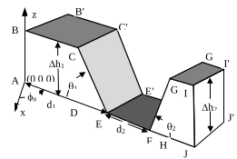
*the DEM*
</img>

!!!question
    The file `dart.txt` stores the scene albedo A, the extrapolated scene albedo and the corresponding relative error per iteration n. The image below shows these products. It appears that 14 iterations are needed in order to get the extrapolated albedo with a relative error less than $10^{-3}$.

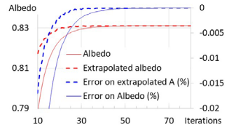
*Scene albedo as a function of the number of iterations.*
</img>

### 5) BRF and BTF of "Slope + Vegetation plot simulated with facets": WP7E

!!!note
    The layer is simulated as facets because the use of turbid cells is often inaccurate. Indeed, some turbid cells are below the slope and cells being either 0% or 100% filled, the layer top has an unrealistic roughness.

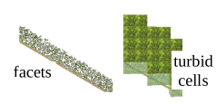</img>

#### 5.a - Creation of a slope 3D object defined as an horizontal ground surface: WP7Ea

Create dsm.obj with "Maket + option ". Scene "DX=30m, DY=1m. $\Delta x=\Delta y=\Delta z=0.2m$".

#### 5.b - brf/btf(LAI, sun direction, slope) of "slope + vegetation layer simulated with triangles (0.003m2)": WP7Eb

<u>*Scene:*</u> DX=10m, DY=1m. $\Delta x=\Delta z=1m$. $0.56\mu m, 0.9\mu m, 10\mu m. \theta_{sun}=30°, \phi_{sun}=0°$. Solar plane sampled. M=50 sub-faces for accurate hot spot simulation. DEM = dsm.obj with $\rho_{loam \:brown \:intermediate}$. 10mx1m vegetation plot simulated with facets $(0.003m^2)$. $\rho_{leaf}='$leaf_deciduous', spherical LAD. $T \in [290K;\: 310K]$. LUT=only product.

<u>*Sequence:*</u> LAI: 0, 1, 3; Scene slope: 0, 20°, 50°; Scene azimuth angle: 0°, 45°. 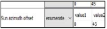

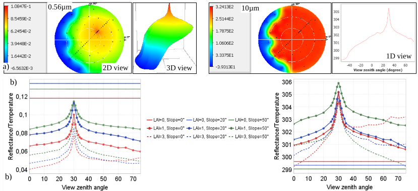</img>
*2D and 1D graphs. a) $\rho_{scene,0.56\mu m}(\theta_{view}, \phi_{view})$ and $T_{B,scene,10\mu m}(\theta_{view}, \phi_{view})$ extracted from the LUT by the tool `View/Directional` refl./Extract. from LUT'. b) LUT plots: $\rho_{slope,0.56\mu m}(\theta_{view})$ and $T_{B,slope,10\mu m}(\theta_{view})$ for {LAI: 0, 1, 3; slope: 0°, 20°, 50°; $\phi_{sun}=\phi_{view}$= angle offsets=0°: solar plane}. Curves are smoother with smaller facets.*

### 6) Inversion of satellite image in terms of surface reflectance: WP7F

<u>*Objective:*</u> to derive material reflectance $\rho_{loc}(x,y)$ from an atmospherically corrected satellite image $\rho_{sat}(x,y,\Omega_v)$.

**Scene** (see the image a. below): 40m x 40m. $\Delta x=\Delta y=\Delta z=0.5m$. Imported pyramid {center: (20m, 20m), scale factor 8, $\rho_{pyramid} =0.2, \rho_{ground} = 0.1$}. $\theta_{sun}=45°, \phi_{sun}=90°$, SKYL = 0. Illumination grid: 0.02m. Add the satellite direction $\theta_v=0°$.

**Run DART with option** "": Energy conservation" to create the ortho-rectified satellite image $\rho_{sat}(x,y,\Omega_v)$ (see the image b. below). Store it in the folder `WP7F/input/Satellite`.

**Run 'Topography' tool** ([III.7.6](../../DART_functionalities_and_products/7-Tools_menu/7.6/topography_tools.md#topography-correction)): result in 'WP7F/Corrected'. $N_{max \:iterations} = 4$. Thresholdmean reflectance = $10^{-5}$.

- The procedure stops at iteration 4. The image b. below shows the surface reflectance image $\rho_{loc}(x,y)$. Verify that: $\overline{\rho}_{pyramid}=0.2, \overline{\sigma}_{pyramid} =1.2\times 10^{-5}, \overline{\rho}_{ground}=0.1, \overline{\sigma}_{ground}=3\times10^{-6}$

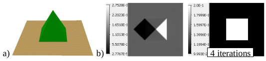</img>

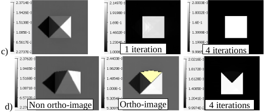</img>
*a) 3D scene. b) Nadir DART ortho-image ρsat (x,y) and surface reflectance image $\rho_{loc}(x,y)$. SKYL=0 (WP7F). c) $\theta_v=0°$, SKYL=0.3 (WP7F_nadir_SKYL). d) $\theta_v=30°, \phi_v=0°$, SKYL=0.3 (WP7F_oblique_SKYL).*

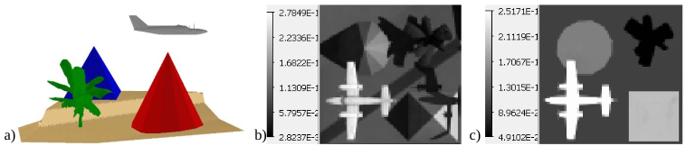</img>
*a) Scene (WP7F_plane): $\rho_{pyramid}=0.2, \rho_{cone}=0.15, \rho_{plane}=0.25, \rho_{ground}=0.1, \rho_{banana}=0.05$. SKYL=0.3. b) DART image. c) Surface reflectance image: $\rho_{pyramid}=0.1988, \rho_{cone}=0.1496, \rho_{plane}=0.25, \rho_{ground}=0.0999, \rho_{banana}=0.05001.$*

### 7) Inversion of a satellite image (Bassies mountain area)
as $\rho_{ground}(x,y)$ (cf. [VII.5-WP5Bb](../T5/t5.md#2b---scene-with-dem-and-covermap-bassies_nosnow50mp-wp5bb_lux-and-wp5bb-ft-ct24)): WP7G

<u>*Scene:*</u> $\Delta X=4.9km, \Delta Y=5.4km, \Delta x,y,z=50m$, DEM (…\CoverMap\Bassies\Bassies_DEM50). $\lambda=0.56\mu m$. Analytic model.

<u>*Simulation:*</u> add a nadir direction. The image to correct will be created for this direction.

**WP7Ga:**

- Import the CoverMap `Bassies_nosnow50.mp#` (descriptor `Bassies_CoverMap_Descriptor.txt`). Plots are surfaces (rock (concrete): $\rho_{rock}=0.10975$, vegetation (grass rye): $\rho_{veg}=0.2626$).
- Run DART to create the image (see the image c. below) to correct: $\rho_{sat} \in [0.019;\: 0.288], \overline{\rho}_{sat} = 0.118$).

**WP7Gb:**

- Save WP7Ga as. Then, keep the DEM only and set $\rho_{ground}=1$ with a multiplicative factor, because the image result is the "multiplicative factor" image. Plots can be removed by deleting the `plots.xml` file.
- Run the "Topography correction" tool. The image of surface reflectance has 2 peaks centred on
$\rho_{sat,rock} \approx 0.1105 and \rho_{veg} \approx 0.2635$ (see the image e. below), as expected.

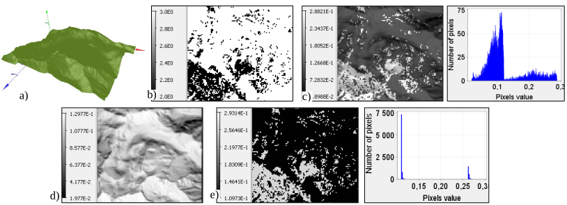</img>
*Inversion of Bassies satellite image. a) DEM. b) Cover map. c) Satellite image to correct and its histogram. d) DART image at $1^{st}$ iteration ($\rho_{loc}=\overline{\rho}_{sat} =0.118$). e) Surface reflectance image and its histogram.*

