### 1) Horizontal ground surface: WP8A

<u>*Objective:*</u> waveform of a single Lidar pulse for an horizontal ground surface.

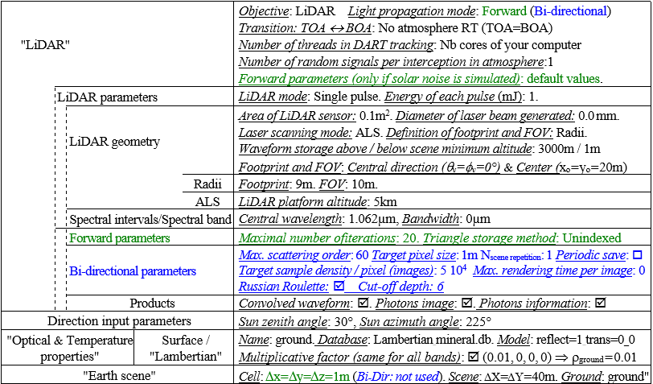
*Parameters for WP8A and WP8B. Lidar half reception angle is $atan(\frac {R_{FOV}} {altitude})$*
</img>

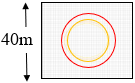
*The field of view (red) is larger than the footprint (orange).*
</img>

**Run DART and display the waveform (`View/ Lidar / Mono pulse`) and Lidar images (`View/ Image`)**

1mJ pulse has $N_{phot}=\frac {Pulse\:\:energy:\:1mJ} {Photon\:\:energy:\:h\nu=1.87048\times10^{-19}}=5.3462\times10^{15}$ photons, simulated by $N_{phot\:DART}=10^5$ DART photons.

File `stat_illumination_MC0.txt` (folder `output/BAND0`): scattering maximum order, number of DART photons emitted $(N_{phot})$, incident on the ground $(N_{ground})$, absorbed measured $(N_{mesured})$, etc.

$N_{measured}=\int_{\Delta \Omega_{fp}} \frac {N_{phot}} {\Delta \Omega_{fp}}.\frac {\rho_{ground}} {\pi}.\frac{A_t cos^4(\theta)}{H^2}.d\Omega=N_{phot}.\frac {\rho_{ground}} {\pi}.\frac {A_t} {H^2}.\frac {\int_{0}^{2\pi} \int_{0}^{\theta_{fp}} cos^4(\theta).sin(\theta).d\theta.d\phi} {\int_{0}^{2\pi} \int_{0}^{\theta_{fp}} sin(\theta).d\theta.d\phi} = N_{phot}.\frac {\rho_{ground}} {\pi}.\frac {A_t} {H^2}.\frac {1 - cos^5(\theta_{fp})} {5.(1 - cos(\theta_{fp}))}$

with H=LiDAR altitude, $A_t=LiDAR$ aperture area, and $\theta_{fp}$= half angle of beam divergence. Usually, the beam divergence is very small, that is $\lim\limits_{\theta_{fp} \rightarrow 0} \frac {1 - cos^5(\theta_{fp})} {5.(1 - cos(\theta_{fp}))}=1$. We have: $N_{measured} = N_{phot}.\frac {\rho_{ground}} {\pi}.\frac {A_t} {H^2}$.

!!!question
    Check: $N_{ground}=N_{phot}=5.3462.10^{15}$ and $N_{measured}=68070$ (it is divided by 100 if LiDAR altitude is multiplied by 10).

**"View / Lidar / Mono pulse"**

- Total and $1^{st}$ order non-convolved and convolved waveforms (see below): the horizontal axis shows the number of photons or the energy, the left vertical axis shows the absolute time or time relative to the ground, and the right vertical axis shows the absolute distance or distance relative to the ground.

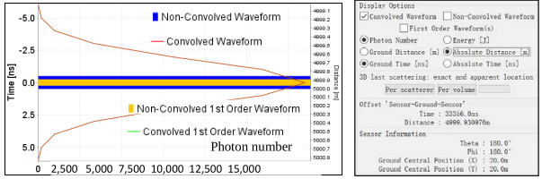
*Lidar $1^{st}$ and multiple order waveforms from ground. They are equal if there is no atmosphere.*
</img>

- 3D cloud of apparent and exact scatterer points ( option) and scattering volumes ( option) (see below). For flat bare ground, the apparent and exact 3D locations of last scattering location are identical since there is no multiple scattering. The histograms show the number of measured photons per energy value; a cursor can be slided to hide the least energetic photons (see the image d. and e. below). For flat bare ground, the 2D Ga

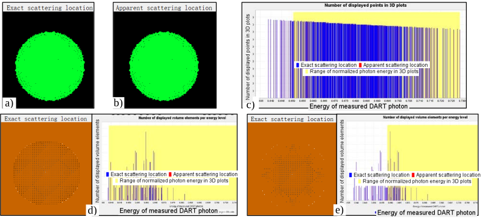
*Per scatterer option: a) Exact and b) apparent 3D location of last scattering; c) Histogram of photons in a,b). Per volume option: exact 3D location of last scattering d) without and e) with user specified energy threshold.*
</img>

**"View / Image".** LiDAR images (see below) help to analyze LiDAR results. Their reference is the LiDAR frame (i.e., label 'Lidar') or the simulated scene (i.e., label 'MaketFrame'). Here, for a LiDAR at nadir, the 'MaketFrame' and 'Lidar' images are equal. LiDAR (incident) pulse image (see the image a. below) and LiDAR BOA image (see the image b. below) are the number of emitted $N_{photons}^{\downarrow}$ and received $N_{photons}^{\uparrow}$ photons in LiDAR frame. The LiDAR reflectance image (see the image c. below) is the ratio $\frac {\pi N_{photons\:at\:BOA\:that\:head\:to\:the\:LiDAR\:within\:Min(\Delta \omega_{LiDAR}(x,y),\Delta \Omega_{LiDAR})}^{\uparrow}} {N_{photons\:at\:(x,y) \in footprint\:at\:BOA}.cos(\theta_{LiDAR\:(x,y)}).Min(\Delta \omega_{LiDAR}(x,y), \Delta \Omega_{LiDAR})}$, with LiDAR field of view $\Delta \Omega_{LiDAR}$, solid angle $\Delta \omega_{LiDAR}(x,y)$ under which (x,y) sees the LiDAR aperture, and $\theta_{LiDAR}$ directions for (x,y).

!!!question
    Central (9mx9m) LiDAR reflectance image $\rho_{footprint} \in [0.00989, \:0.01009]$. It is not exactly 0.01:. Why?

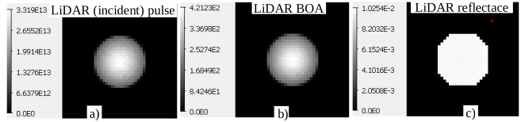
*LiDAR images.*
</img>

Values change with simulations, except if option "Results are identical if…" is set.

### 2) Horizontal ground surface and atmosphere: WP8B

<u>*Objective:*</u> waveform of a single Liadar pulse for an horizontal ground surface.

**Save WP8A as WP8B**. Then, define an atmosphere with mono-band (monospectral) parameters" (see below): optical depth of scattering gases equal to 4, no absorbing gases and no aerosols. The waveform (see below) is more or less the sum "Ground signal through the atmosphere" + "Signal from the atmosphere". It depends on the parameter “Advanced mode / LiDAR $\rightarrow  N_{random} =$ Number of random signals per interception in atmosphere”.

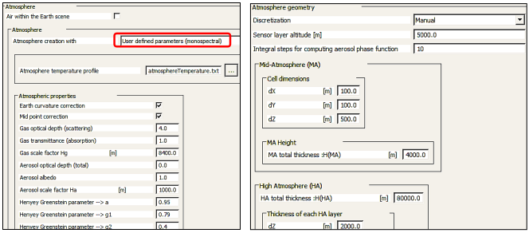
*Parameters of the atmosphere*
</img>

!!!question
    The atmosphere signal increases with altitude conversely to atmosphere density? Why?
!!!question
    The waveform is "better" if $N_{random} = 20$ (see the image a. below) instead of 1 (see the image a. below). Why?

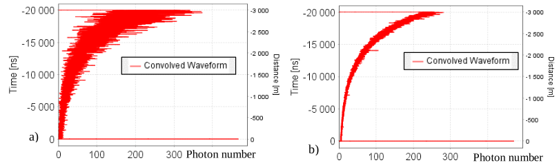
*Lidar waveform.*
</img>

### 3) Urban scene: WP8C

<u>*Objective:*</u> waveform in presence of two horizontal surfaces at two different altitudes.

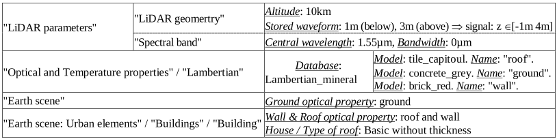
*Parameters for WP8C.*
</img>

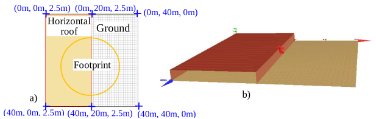
*Simulated scene: house and ground. a) 2D view. c) 3D view.*
</img>

**Run DART and display the waveform**

In the image below, the 1D waveform (a, b) has 1 peak for the ground and 1 peak for the horizontal roof, with 17ns (i.e., 2.5 m distance) between the 2 peaks, and the 3D graphs display scattered energy:

- <u>per scatterer:</u> per actual (d) and per perceived (e) location of the last scatterer. Each vertical bar of (f) represents "Total measured energy * $10^{-3}$". The distance between the extreme bars gives the normalized energy range per scattering event in terms of actual photons. Its height is the associated number of scattering events (i.e., number of DART photons) in the simulation. The cursor cn be moved to hite least energetic photons in the 3D displays.
- <u>per volume</u> (i.e., scene cell): per actual (g) and per perceived (h) location of cell. The histogram horizontal axis (i) shows the energy scattered per cell. The vertical axis shows the number of cells that scatter a given energy per cell.

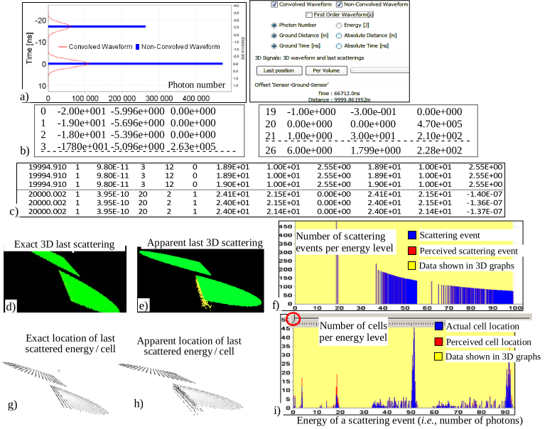
*a) 1D raw/ convolved waveform. b) 1D raw waveform (`lidar_dart_wave.txt`): bin number, time (ns) and number of photons. c) Data per measured photon (file phtonInformations.binary) are shown per scattering event (d,e,f) or cell volume (g,h,i), either per exact (d,g) or apparent (e,h) location of last scattering; a cursor manages the display of least energetic scatterers in 3D graphs (f, i).*
</img>

**Display LiDAR images with "View/ Images"**

For a single pulse, the signal of usual LiDAR systems is a 1D data array (e.g., waveform). DART can display it as images (see below) in terms of number of photons / pixel in order to help in understanding simulation results.

- 3 images in LiDAR reference (plane perpendicular to view direction). a) LiDAR emitted pulse at BOA level. c) Photons backscattered along LiDAR direction at BOA level. d) LiDAR reflectance image. It gives the reflectance of scene elements. This image can be useful for testing the accuracy of LiDAR simulations.
- 1 image in scene reference (PhotonReachedGround_MaketFrame): photons that reached the ground b).

!!! question
    Ground scatters more photons than the horizontal roof: $N_{ground}^{\uparrow} \approx 4.787\times 10^5$, $N_{roof}^{\uparrow} \approx 2.637 \times10^5$. Why?

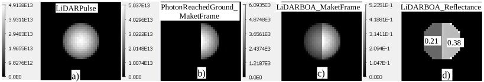
*LiDAR images.*
</img>

### 4) Topography: WP8D

<u>*Objective:*</u> variation of the LiDAR waveform with the slope of a 40m x 40m bare ground plane surface.

**Create 6 slopes (0°, 5°, 10°, 30°, 45°, 60°):** use "DEMGenerator" (see the image b. below) and parameters in (see the image a. below).

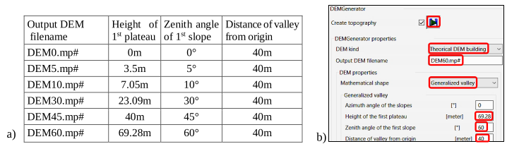
*a) Parameters for creating 6 DEMs. b) Menu with parameters for the 60° slope.*
</img>

**Run the 6 simulations with the 6 DEMs and display the resulting waveforms** (see below).

!!!question
    Verify that the peaks of the waveforms correspond to the DEM mean altitudes.
!!!question
    Why waveforms with slopes < 45° have discontinuous shapes?

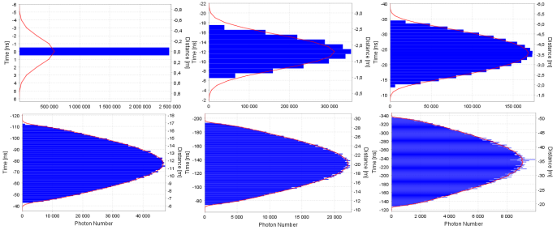
*Lidar waveform of a slope with 6 angles: 0°, 5°, 10°, 30°, 45° and 60°.*
</img>

### 5) Homogeneous turbid vegetation scene: WP8E

<u>*Objective:*</u> LiDAR waveform of a 5m thick turbid vegetation layer (LAI = 5) over an horizontal ground (Fsee below).

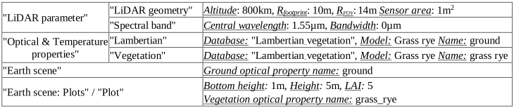
*DART parameters for WP8E.*
</img>

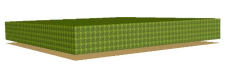
*Vegetation plot over a horizontal bare ground.*
</img>

!!!question
    The waveform (see below) has 2 peaks. Why?
!!!question
    Apparent scatterer location:
         - there are scatterers 'below' the ground, but no above the plot. Why?
         - the waveform is nearly 100% 1st order at its upper part. Why?

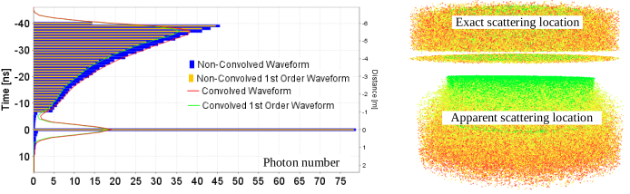
*a) 1st order and total waveforms, convolved and not convolved. b) 3D display of last scattering location.*
</img>

**Schematic inversion of 1st order lidar signal in terms of LAI and $r_{ground}$**

Let a vegetation plot with LAI = LAI plot and ground reflectance ρground. The file `stat_illumination_MC0.txt` (`Photons_Order1.xls`) gives the number $N_{phot,scene,in}$ of incident photons in the footprint, and the numbers $N_{phot,ground,mes,1}$ and $N_{phot,plot,mes,1}$ of ground and plot 1st order photons measured by the LiDAR, respectively. Here, there is no atmosphere. The Lidar is at nadir $(θ=0°)$, at an altitude H=800km with an area $A=1m^2$. It is viewed from the ground with the solid angle $\Delta \Omega_{lidar}=\frac {A} {H^2}.cos^3(\theta_{lidar})$.

<u>*Ground:*</u> $N_{phot,ground,mes,1} = N_{phot,scene,in}.e^{- G(\Omega_s).LAI_{plot}}.\frac {\rho_{ground}} {\pi}.\Delta \Omega_{lidar}$ with $G(\Omega_s) = \frac {total\:leaf\:area\:along\:direction\:\Omega_s} {total\:leaf\:area}$. For a spherical LAD: $G(\Omega_s)=0.5$.

<u>*Plot:*</u> $N_{phot,ground,mes,1} = N_{phot,scene,in}.(1 - e^{- G(\Omega_s).LAI_{plot}}).\frac {T(\Omega_s, \Omega_v)} {\Delta \Omega_{dart}}.\Delta \Omega_{lidar}$. Here: $\frac {T(\Omega_s, \Omega_v)} {\Delta \Omega_{dart}} \approx 5.14\times10^{-2}$.  
with $T(\Omega_s, \Omega_v)=$ leaf transfer function (lib_phase/0.grass_rye_ScatteringFunction) for incident direction $\Omega_s=\Omega_{lidar}$ to discrete direction ($\Omega_v, \Delta \Omega_{dart}$) that comprises the LiDAR direction ($\Omega_{lidar},\Delta \Omega_{lidar})$". Here: $\theta_{lidar}=\theta_v=0$.

$\implies LAI_{plot}= - \frac {1} {G(\Omega_s)}.ln(1- \frac {N_{phot,plot,mes,1}.\Delta \Omega_{dart}} {N_{phot,scene,in}.T(\Omega_s, \Omega_v).\Delta \Omega_{lidar}})$ and $\rho_{ground}=\frac {\pi} {\Delta \Omega_{lidar}}.\frac {N_{phot,ground,mes,1}} {N_{phot,scene,in}}.\frac {1} {e^{-G(\Omega_s).LAI_{plot}}}$.

Here: 

- `stat_illumination_MC0.txt`: $N_{phot,scene,in}=7.8\times10^{15}, N_{phot,ground,mes,1}=77.42$ (theory 77.3), $N_{phot,plot,mes,1} = 571.47$ (theory: 574.09)
- $r_{ground}=0.243, T(\Omega_s, \Omega_v)=0.00648, \Delta \Omega_{dart}=0.1263, \Delta \Omega_{lidar}=1.56\times10^{-12}$.

This schematic inversion gives: $LAI_{plot} = 4.896$ and $r_{ground} = 0.243$. Here, its use with $1^{st}$ and multiple order photons (i.e., actual LiDAR) does not work. It is less accurate, because actual LiDARs contain multiple order. Here, there is no solution with all scattering order photons. A possible solution is to consider the shape of the waveform with $\omega_{leaf}$ being an unknown.

### 6) 3D vegetation: WP8F

<u>*Objective:*</u> waveform of "3D cherry tree + plane ground" is simulated with the tree crown simulated as a set of facets (see the image a. below), then as a set of turbid cells derived from the crown simulated with facets (see the image d. below).

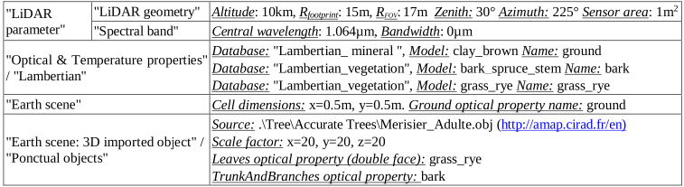
*DART parameters for WP8F. The leaves and trunk of the tree are triangles.*
</img>

For the facet- and turbid-trees, the images below show the cloud of last scattering points (b,e), and the corresponding 3D (c,f) / 1D (g,h) waveforms and 2 Lidar FOV images: "ground incident photons" in scene reference (i.e., ellipse) and "BOA LiDAR signal" in Lidar reference (i.e., disk). The closeness of facet- and turbid-derived results illustrates the interest of the transformation 'facet $\rightarrow$ turbid'. Its use is advided or not depending on.

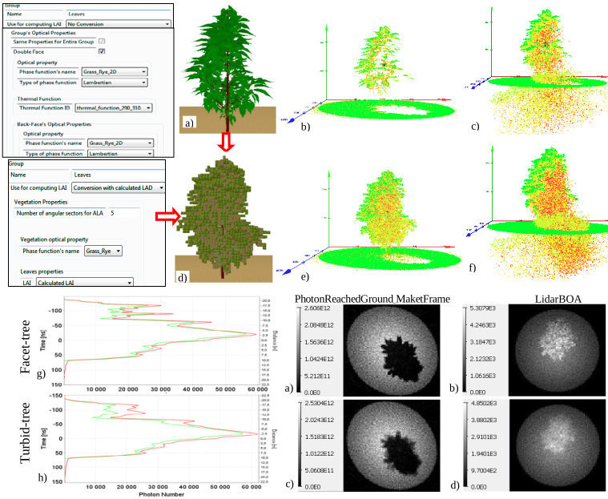
*For the fact- and turbid- tree: 3D exact (b,e) and apparent (c,f) positions of last scatterers, 1st/total scattering order waveform (g,h), and LiDAR images.*
</img>

### 7) 3D triangle tree + Atmosphere: WP8G

<u>*Objective:*</u> waveform with atmosphere (<u>Aerosol:</u> Rural V=5km; <u>Gas:</u> Mid-Latitude summer) above and in the Earth scene (see below).

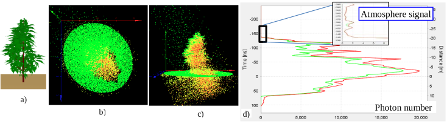
*a) Earth scene. Top view (b) and front view (c) of apparent location of last scattering events. d) Waveform.*
</img>

### 8) Multi-pulse ALS acquisition: WP8H

<u>*Objective:*</u> Lidar scanner acquisition for the scene {bare ground, 3D triangle tree, no atmosphere}.

The image below shows the ALS scan grid and the input parameters in order to simulate it:

- Swath begin and end positions (x, y) on the ground.
- Azimuth angle (squint angle): if sensor scan direction is not perpendicular to the flight direction.
- Control Point (CP): position (x, y) on the ground and look angle at CP.
- Grid: azimuth separation (meter) and range separation (rad or meter) of the acquisition grid.
- "Multithread" option. Indeed, pulse information is specific per pulse.

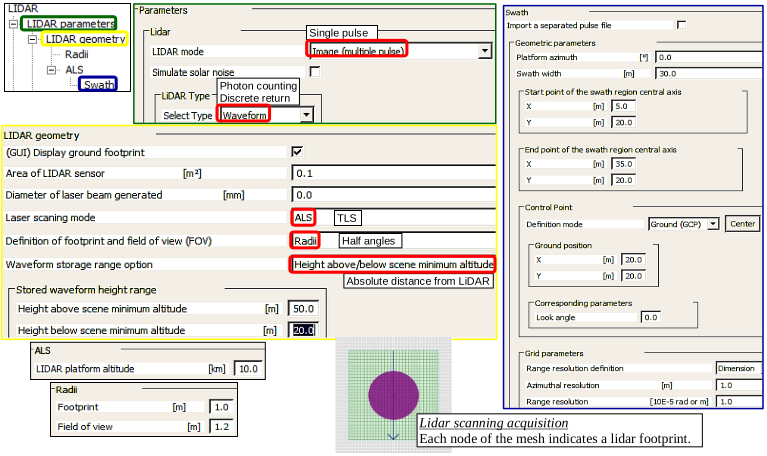
*Menu for creating an ALS scanner acquisition.*
</img>

The image below shows the 3D multi-pulse "convolved waveform" (b) and its individual components (a).

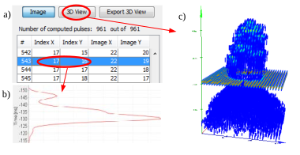
*"Lidar Multi-pulse" graph. a) Selection menu. Node (17, 16) is selected. b) Waveform of node (17,16). c) 3D convolved waveform for each Lidar pulse. Blue color is for lower energy levels.*
</img>

### 9) Multi-pulse TLS acquisition: WP8I

<u>*Objective:*</u> TLS simulation of same scene as WP8H.

!!! warning
    The volume to store (file `LIDAR_IMAGE_FILE.binary`) depends on TLS range and angular resolutions. It can be huge

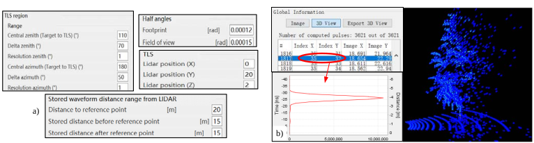
*TLS simulation. Direction $(\theta=110°,\phi=180°)$ is from target to TLS. a) Menus. b) TLS 3D view.*
</img>

### 10) Single-pulse Lidar waveform with solar noise: WP8J

<u>*Objective:*</u> LiDAR signal with solar noise for a scene with 10 cherry trees and 1 classic building (see below).

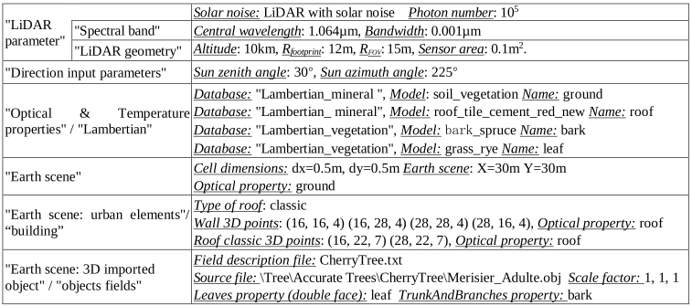
*DART parameters for WP8J.*
</img>

Solar noise is computed by simulating the radiance of the LiDAR ground FOV due to the reflectance of sun radiation. It adds a constant number of photons to the LiDAR signal. Here, it is very small. It would be higher with a smaller sun zenith angle. Also, its relative importance would be larger with a smaller Lidar pulse energy.

- DART-FT simulation of solar time is slow compared to LiDAR simulation. It is greatly faster with DART-Lux.

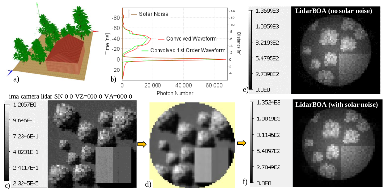
*a) 3D scene; b) LiDAR waveform with solar signal; c) Solar noise reflectance of total scene; d) LiDAR footprint in (c). e) Lidar (photons) BOA image without sun. f) Lidar (photons) BOA image with sun.*
</img>

### 11) Lidar discrete return (point cloud): WP8K

<u>*Objective:*</u> ALS point cloud simulation of same scene as WP8J.

DART-RC and DART-Lux LiDAR simulate waveforms and transform them into point cloud that they store to file `DetectedPoints.txt`. Two transformation methods are available: i) DART external process (script `DART2LAS.py` based on laspy library); ii) DART internal processing.

!!question
    Why are there very few points returned from the ground under the trees?
!!!question
    Why are there holes in the top view of point cloud? What factor affects the area of holes?
!!!question
    Why are the apparent reflectance of two roofs different? What factor affects the apparent reflectance?

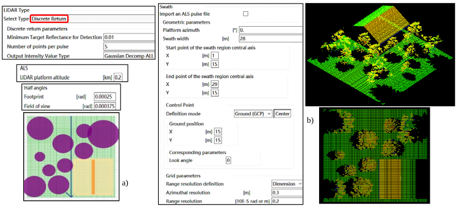
*ALS 3D point cloud. a) Menus. b) CloudCompare display: color by intensity value (apparent reflectance).*
</img>

### 12) Lidar photon counting with atmosphere and solar noise: WP8L

<u>*Objective:*</u> ALS photon counting simulation of MABEL instrument. Same scene as WP8J, with sun and atmosphere.

Photon count (i.e., file `DetectedPoints.txt`) is internally simulated by DART or computed by applying the DART python script "photoncounting.py" to the DART simulated waveform binary file. Solar noise is computed with the "Pushbroom" option or "Camera" option (a solar noise image is computed per LiDAR node $\implies$ very time consuming).

- Solar noise is present in the entire vertical space. Why?
- Which factors do influence the density of solar photons?

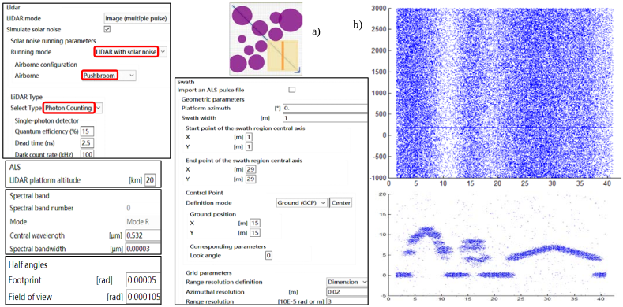
*ALS photon counting. a) Menus. b) 3D photon points in vertical ranges [-1000m 3000m] and [-5m 20m].*
</img>

### 13) High-efficiency Lidar simulation: WP8M

<u>*Objective:*</u> relative efficiency of DART-Lux LiDAR and DART-RC to simulate single-pulse waveforms (see below).

First, the consistency of DART-Lux LiDAR and DART-RC is verified using a large number of photons: for $N_{phot}=10^8$, their waveforms are nearly equal ($R^2=1$, rRMSE=0.01; see the image b. below). Using them as a reference, DART-Lux LiDAR and DART-RC are run with increasing $N_{phot}$: their resulting waveforms gradually converge to the reference (see the image c. below). However, for a same $N_{phot}$, the DART-Lux waveform is closer to the reference (see the image d. below). For example, for $N_{phot}=10^3$: $R^2=0.991$ and rRMSE=0.17 for DART-RC, whereas $R^2=0.995$ and rRMSE=0.1 for DART-Lux.

!!!question
    Why does the waveform gradually converges if the photon number increases?
!!!question
    Why is DART-Lux LiDAR mode more accurate than DART-RC with the same photon number?

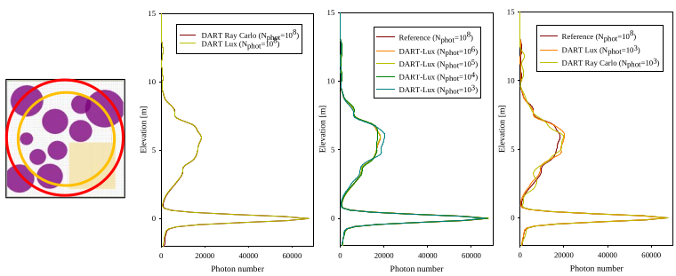
*a) Scene and LiDAR footprint and FOV. b) DART-Lux and DART-RC waveforms (Nphot=108). b) DART-Lux waveforms with various $N_{phot}$. c) DART-Lux and DART-RC $(N_{phot}=10^3)$ with reference waveform.*
</img>

***Lidar photon counting with atmosphere and solar noise***

Photon counting can be simulated by applying a python script to DART simulated waveforms. Photon counting devices tend to have much smaller bin lengths (e.g., 0.1 ns) and higher pulse repetition frequencies that waveform LiDARs (bin length: 1-10ns; 20 points / $m^2$). The provided python script has solar noise option. It processes waveforms to assess the probability to measure photons. Then, random pulling is used to state if a photon is detected in a given bin. If it is detected, its 3D position is stored. Then, 3D plotting gives the photon counting LiDAR beam.

For a sensor with quantum efficiency = 0.015, detector dead time = 2.5ns and dark count rate = 100 kHz: `python photoncounting.py LIDAR_IMAGE_FILE.binary photons.txt 0.015 2.5 100`

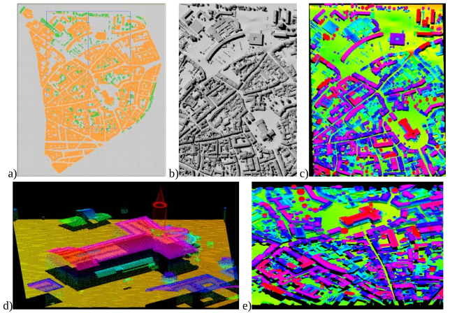
*Lidar multi-pulse acquisition for the St Sernin district of Toulouse (France). a) Toulouse geometric database. b) DART-FT reflectance image. c) Multi-pulse Lidar image (800 x 520m). 560nm. $10\mu J$. Footprint diameter: 50cm. Sensor area: $0.15m^2$. Sensor height: 1km. Acquisition rate: 1ns. Resolution: 0.25x0.25m (16 points / $m^2$). Platform azimuth: 0°. Look angle at swath center: 0°. $6.656\times 10^6$ Lidar pulses ($10^3$ photons/pulse). Lidar images process with SPDlib software.*
</img>

