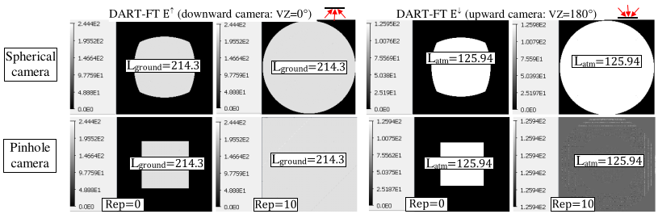
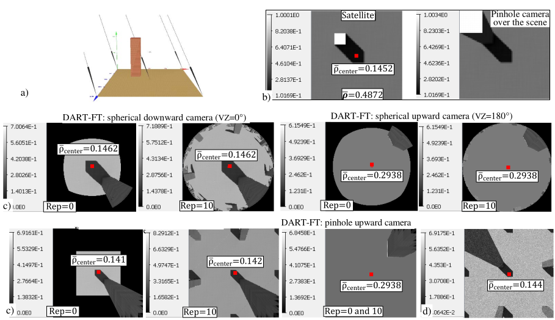
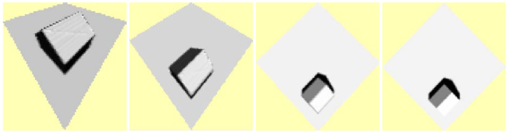
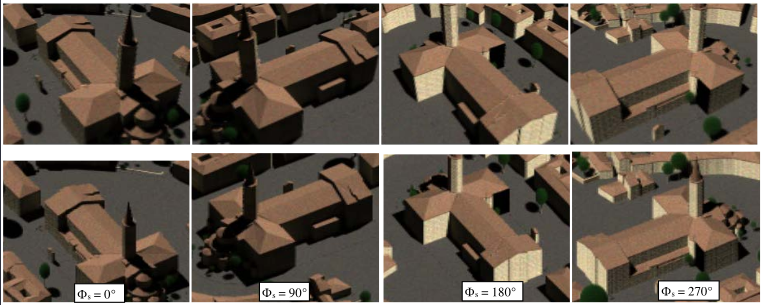
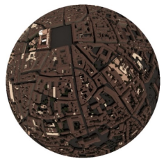

<u>*Objective:*</u> to simulate sensors (camera, push-broom) with a non null field of view (FOV). For DART-FT, pushbrooms and frame cameras are above the Earth scene, and pinhole and spherical cameras are in the Earth scene. DART-Lux "pinhole camera" simulates cameras outside and inside the Earth scene.

### 1) Pinhole and spherical camera with horizontal bare ground: WP9A

<u>*Objective:*</u> to introduce DART-FT cameras for the case of a simple horizontal bare ground.

<u>*Scene:*</u> 40x40m. $\Delta x=\Delta z=0.5m$. $\rho_{ground}=0.5$. $\theta_s=30°, \phi_s=225°$. Mode "Infinite slope". Small transparent ($t_{dir}=1$) facet (isocele triangle: 0.02m x 0.01m) at $z_{facet}=30m$ (this altitude allows one to use a DART-FT within scene camera).

<u>*Cameras:*</u>

- frame camera (above scene): x=y=20m, z=40m, vertical downward looking:  $\theta = 0°$

- spherical (radius: 0.1m, $\theta_{FOV,max}$ : 90 $\implies$ view of hemisphere) and pinhole (sensor: 0.54x0.54m, focal: 0.1m) cameras: $z_{cam}=15m < z_{facet}$, 1000 x 1000 pixels, Rep=0 & 10 scene repetitions ($\theta_{max} =53°$ & $88°$), upward ($_theta_{cam}=0° \implies$ image Camera_xx_VZ=180_VA=0) and downward ($\theta_{cam}=180°$) vertical looking. Camera image coordinates (i,j) and viewing angles $(\theta_v,\phi_v)$ are linked by equations. $\rho_{camera}(i,j) = \frac {\pi \times L_{camera}(i,j)} {BOA\:irradiance}$

DART-FT sun / atmosphere illumination of pixel j of an upward looking camera is simulated with rays from mesh elements i the BOA plane (witthout "penumbra" option: sun surface radiance is spatially constant and isotropic):

- Sun solid angle subtended: $\Delta \Omega_{sun} = \frac {\pi.R_{sun}^2} {l_{sun-camera}^2}$ from the camera and $\Delta \Omega_{sun,i} \approx \frac {\pi.R_{sun}^2} {l_{sun-BOA}^2} \approx 6.8 \times 10^{-5}$ sr from BOA. $l=distance$.
- BOA direct sun energy that is measured: $\sum_{i=1}^{I} \chi_{ij}.L_{sun,BOA,i}(\Omega_i).\Delta \Omega_{sun,i}.\Delta P_i.cos(\theta_i)$ with $L_{sun,BOA,i}(\Omega_i) = \frac {E_{sun,BOA}} {cos(\theta_i).\Delta \Omega_{sun,i}}$ with $\Delta P_i = D^2 =$ area of DART-FT BOA illumination mesh element i that the camera pixel j sees within $\Delta \Omega_{sun}$.
    - $I.D^2 =$ sun projection on BOA = $\Delta \Omega_{sun}.l_{BOA-camera}^2$.
    - $\chi_{ij}$ = direct transmittance "$\Delta P_i$ - camera pixel j" along $(\Omega_{sun,i}, \Delta \Omega_{sun,i}$).
- Atmosphere radiance $L_{atm,BOA,i}(\Omega_i)$ is the result of the interpolation on atmosphere radiance in DART discrete directions neighbor of $\Omega_i$. For an isotropic atmosphere: $L_{atm,BOA,i}= \frac {E_{atm,BOA}} {\pi}$

Camera radiance images and dart.txt values are consistent. The screenshots below show images of upward / downward looking pinhole and spherical cameras. Here, the option "Penumbra" is not set. Therefore, the upward looking camera only measures atmosphere radiation. Although this camera does not see the sun, the propagation of sun radiation is simulated: the downward looking camera sees the correct upward radiation whatever the option "Penumbra".

*Spherical (top) and pinhole (bottom) camera images (1000 x 1000). Downward (left) / upward (right) looking directions. Option "Penumbra" is not set. Scene repetition is Rep = 0 and 10.*
</img>

- <u>*dart.txt:*</u>
    - $E_{BOA} =1346.52 W/m^2/\mu m$ ($\implies \overline{L}^{\downarrow}=428.61 W/m^2/sr/\mu m$),
    - $E_{sun,BOA}=950.87 W/m^2/\mu m (\implies L_{sun,BOA} \approx 1.615 \times10^7 W/m^2/sr/\mu m)$
    - $E_{atm,BOA}=395.64 W/m^2/\mu m \implies L_{atm}=125.94 W/m^2/sr/\mu m$
    - $M_{ground}=673.24 W/m^2/\mu m (\rho_{ground}=0.5) \implies L_{ground}=214.3 W/m^2/sr/\mu m$
    
- <u>*Simulation*</u>
    - No penumbra: $E_{spherical}^{\downarrow}$ (Rep=0 / 10) = $394 / 395.64$ $W/m^2/\mu m \approx E_{atm,BOA} \implies \overline{L}_{spherical}^{\downarrow} = L_{atm}$

- <u>*Properties.txt*</u>
    - Penumbra: $E_{spherical}^{\downarrow}$(Rep=0 / 10) = $1671.7 / 1500.1$ $W/m^2/\mu m$ (in `simulation.properties.txt` > $E_{BOA}$
    - Penumbra or not: $E_{spherical}^{\uparrow}$ (Rep=0 / 10) = $671.25 / 673.26$ $W/m^2/\mu m \approx M_{ground} \implies L_{spherical}^{\uparrow} \approx L_{ground}$

- <u>*Upward camera images:*</u>
    - $L_{spherical,atm}^{\downarrow} = L_{pinhole,atm}^{\downarrow}$ (Rep=0 / 10) = $125.94 / 125.94$ $W/m^2/sr/\mu m$
    - No penumbra: $L_{spherical,sun}^{\downarrow} = L_{pinhole,sun}^{\downarrow}$ (Rep=0 / 10) = $0$ $W/m^2/sr/\mu m$
    - With penumbra: Max [$L_{spherical,sun}^{\downarrow}$ ] + $L_{atm} (Rep=0 / 10) = 3.86 \times10^7 / 3.86\times 10^7 W/m^2/sr/\mu m$
    - With penumbra: Max [$L_{pinhole,sun}^{\downarrow}$] + $L_{atm} (Rep=0 / 10) = 3.82 \times10^7 / 3.82\times 10^7 W/m^2/sr/\mu m$

- <u>*Downward camera images:*</u> $L_{spherical}^{\uparrow} = L_{pinhole}^{\uparrow} (Rep=0 / 10) = 214.3 / 214.3 W/m^2/sr/\mu m \implies M_{ground}=673.24 W/m^2/\mu m$

### 2) Pinhole and spherical camera with a 3D scene element: WP9B (copy of WP9A)

<u>*Objective:*</u> to introduce the DART cameras with a simple 3D scene element over horizontal bare ground.

<u>*Scene:*</u> 40mx40m. $\Delta x=\Delta z=0.5m$. House: h=30m, $\rho_{ground}=\rho_{wall}=0.5$, $\rho_{roof}=1.$ $\theta_s=30°, \phi_s=225°$. Mode "Infinite slope".

The images below show the nadir satellite image, the image of a downlooking camera at 40m altitude, and the images of the cameras defined in WP9A. It illustrates that $\rho_{camera}(\Omega_v)=\rho_{satellite}(\Omega_v)$; for example, "Central pixel of the downward spherical camera image" = "Mean satellite nadir image". In the upward image: $\overline{\rho}_{center} = \frac {\pi.L_{nadir}(0°)} {E_{BOA}}=SKYL$.

*DART spherical camera. a) House (h=30m) in a 40mx40m scene. $\rho_{ground}=\rho_{wall}=0.5, \rho_{roof}=1$. b) DART-FT reflectance nadir satellite image and downward nadir frame camera (h=40m). c) DART-FT downward/upward pinhole and spherical cameras (h=15m). Rep=0 and 10 scene repetitions. CT=220s. d) DART-Lux downwar looking pinhole camera image (same as in c). Rep=10. CT=20s.*
</img>

*Pin hole camera image of a flat surface with a house. The camera is at 4 different altitudes (vey low to high). The camera is located at different altitudes on the red vertical axis.*
</img>

*Top: camera image ($\theta_s = 50°$, $z_s = 140m$). Bottom: orthographic projection image $(\theta_s = 50°, z_s = \propto$)*
</img>

</img>

